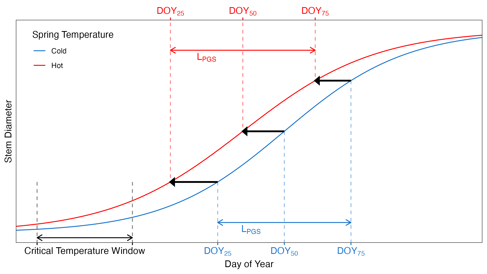

# Warm springs alter timing but not total growth of temperate deciduous trees

This repository contains data and code for an analysis by Cameron Dow, soon to be published in *Nature* (DOI: 10.1038/s41586-022-05092-3). A pre-print of an earlier version (prior to peer review) is available here: https://www.researchsquare.com/article/rs-1093360/v1. 

