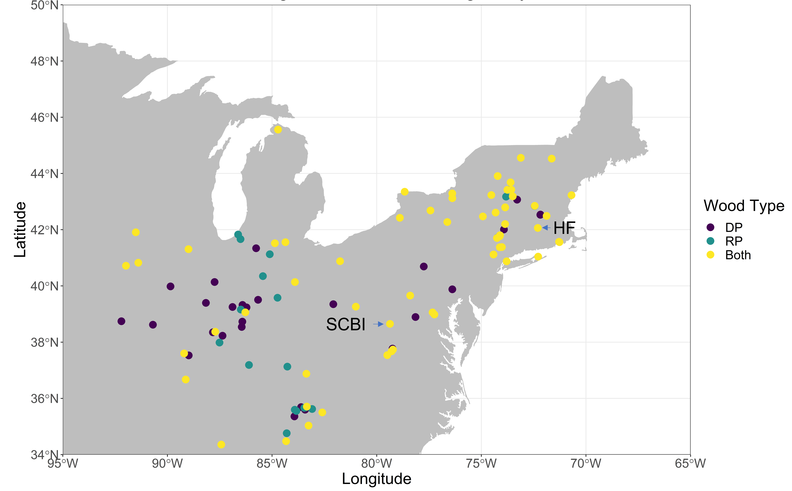
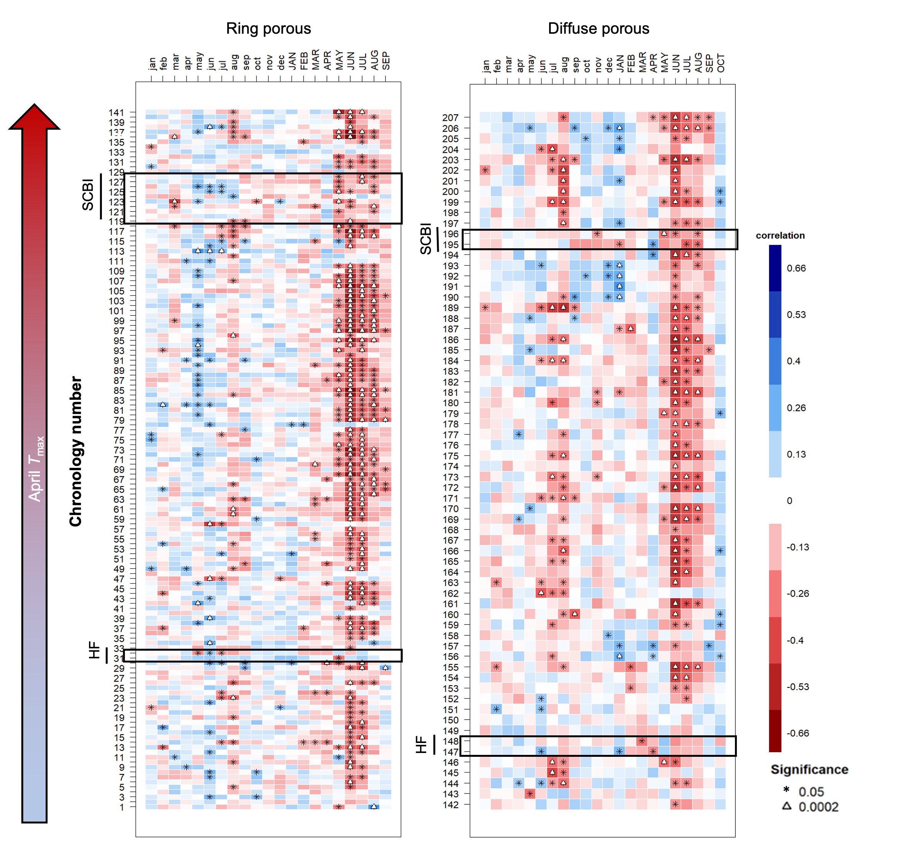

```{r eval = TRUE, echo=FALSE, warning=FALSE, results='hide'}
path_to_results <- paste0(dirname(dirname(getwd())), "/results/") 

# EXTENDED DATA 
##tables
EDT_species="Extended Data Table 1"  
EDT_phenology_parameters="Extended Data Table 2" 
EDT_tree_ring_summary="Extended Data Table 3" 


##figures
EDF_growth_curves_all = "Extended Data Figure 1"  
EDF_climwin = "Extended Data Figure 2"
EDF_pheno_all = "Extended Data Figures 3-4"
EDF_pheno_Tmax_climwin = "Extended Data Figure 3"
EDF_pheno_Tmax_month = "Extended Data Figure 4"
EDF_map = "Extended Data Figure 5" 
EDF_tree_ring_figs= "Extended Data Figure 6-7"
EDF_tree_rings_TMIN = "Extended Data Figure 6"
EDF_tree_rings_TMAX_extended = "Extended Data Figure 7"


###~~~~~~~~~~~~~~~~~~~~~~~~~~~~~~~~~~~~~~~~~~~~~~~~~
## some stats/ 
chronology_table <- read.csv(file = "tables_figures/chronology_table.csv")
n_chronologies <- nrow(chronology_table)  
n_cores_sites <- length(unique(chronology_table[, "Location"]))
n_cores_species <- length(unique(chronology_table[, "Species"]))

```


\newpage

**Extended Data Table 1**

```{r species_table, eval=TRUE, echo=FALSE, warning=FALSE}
library(knitr)
library(kableExtra)

species_table <- read.csv(file = "tables_figures/species_table.csv", col.names = c("site", " ","species", "species code", "n trees", "n tree-years", "n cores", "date range"),  stringsAsFactors = FALSE, check.names = FALSE) 
species_table <- species_table[c(2:3, 5:8)] #subset(species_table, select = -c(Species code) )#remove columns that shouldn't be included

kable(species_table,  format = "latex", booktabs = TRUE,  escape = F) %>%
add_header_above(c( " ", " ", "dendrometer bands" = 2, "tree cores"=2 )) %>%
  pack_rows("SCBI", 1, 10, latex_gap_space = "1em", colnum = 4, hline_before = FALSE) %>%
  pack_rows("", 11, 12, latex_gap_space = "1em", colnum = 4, hline_before = FALSE) %>%
  pack_rows("Harvard Forest", 13, 15, latex_gap_space = "1em", colnum = 4, hline_before = FALSE) %>%
  pack_rows("", 16, 23, latex_gap_space = "1em", colnum = 4, hline_before = FALSE) %>%
kable_styling(latex_options = c("scale_down", "hold_position"), protect_latex = T) 
```

\newpage

**Extended Data Table 2**

```{r mean_growth_parameters_table,  eval=TRUE, echo=FALSE, warning=FALSE}
library(knitr)
library(kableExtra)
mean_growth_parameters <- read.csv("tables_figures/phenology_parameters.csv",  col.names = c("", "ring-porous","diffuse-porous","ring-porous", "diffuse-porous"), stringsAsFactors = FALSE, check.names = FALSE)
kable(mean_growth_parameters, format = "latex", booktabs = TRUE,  escape = F) %>%
add_header_above(c(" ",  "SCBI" = 2, "Harvard Forest"=2 )) %>%
    column_spec(1, width = "4cm") %>%
    pack_rows("Stem Growth", 2, 7, latex_gap_space = "1em", colnum = 4, hline_before = FALSE) %>%
    pack_rows("Canopy Foliage (ecosystem level)", 8, 11, latex_gap_space = "1em", colnum = 4, hline_before = FALSE) %>%
    pack_rows("Temperature sensitivity (days/°C)", 12, 20, latex_gap_space = "1em", colnum = 5, hline_before = FALSE) %>%
    add_indent(13:16)%>%
    add_indent(18:21)%>%
kable_styling(latex_options = c("scale_down", "hold_position"), protect_latex = T) 
```

\newpage

**Extended Data Table 3**

```{r tree_ring_summary,  eval=TRUE, echo=FALSE, warning=FALSE}
library(knitr)
library(kableExtra)
TreeRingResultsSummary <- read.csv("tables_figures/TreeRingResultsSummary.csv",  
                                   stringsAsFactors = FALSE, check.names = FALSE)
TreeRingResultsSummary <- TreeRingResultsSummary[c(2:19)]
kable(TreeRingResultsSummary, 
      col.names = c("species","n","+", "-","+", "-","+", "-","+", "-","+", "-","+", "-","+", "-","+", "-"), 
      format = "latex", booktabs = TRUE,  escape = F) %>%
add_header_above(c(" " = 2,  "March" =2 , "April" = 2, "May" = 2,"June" = 2,"July" = 2,"Aug" = 2,"April" = 2,"June-July" = 2)) %>%
add_header_above(c(" " = 2,  "univariate analysis" = 12,"multivariate analysis" = 4)) %>%
add_header_above(c(" " = 2,  "n. significant bootstrapped correlations of RWI to monthly mean max. T" = 16)) %>%
    column_spec(3:18, width = ".4cm") %>%
pack_rows("Ring-porous", 1, 17, latex_gap_space = "1em", colnum = 4, hline_before = FALSE) %>%
pack_rows("Diffuse-porous", 18, 27, latex_gap_space = "1em", colnum = 4, hline_before = FALSE) %>%
row_spec(28, bold = T) %>%
kable_styling(latex_options = c("scale_down", "hold_position"), protect_latex = T) 
```


\newpage

**Extended Data Figure 1**

{ width=100% }

\newpage

**Extended Data Figure 2**

{ width=70% }


\newpage

**Extended Data Figure 3**

{ width=90% }

\newpage

**Extended Data Figure 4**

{ width=90% }

\newpage

**Extended Data Figure 5**



\newpage

**Extended Data Figure 6**

{ width=100% } 

\newpage

**Extended Data Figure 7**

{ width=100% } 
