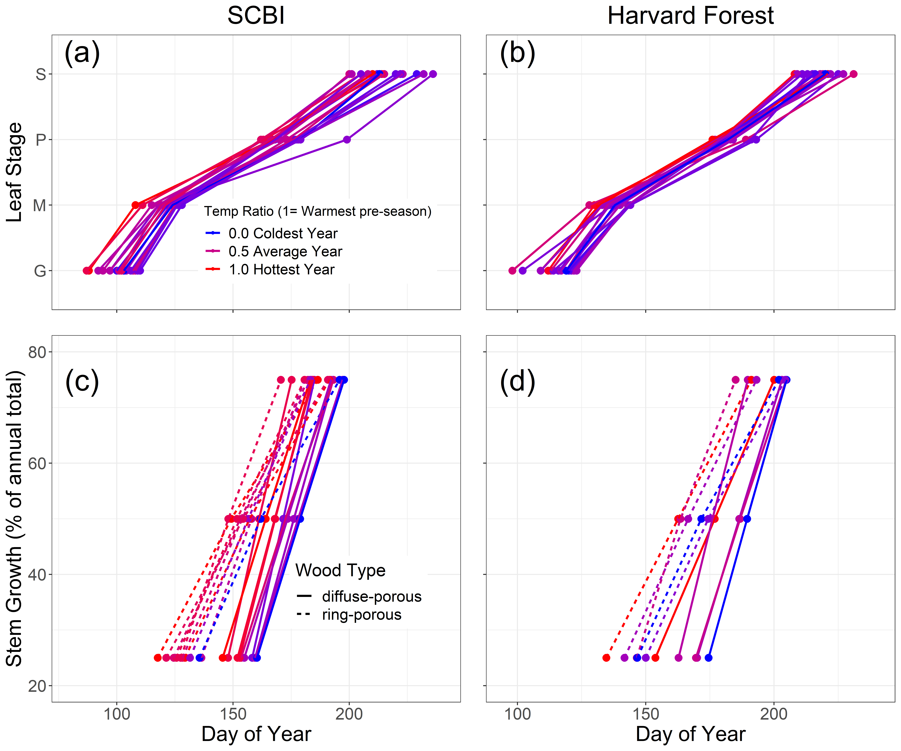

```{r eval = TRUE, echo=FALSE, warning=FALSE, results='hide'}
path_to_results <- paste0(dirname(dirname(getwd())), "/results/") #I was trying to read directly from results folder, but couldn't get it working.

# SUPPLEMENTARY INFO (copied from Dow_manuscript.Rmd)
#SI table numbers
table_species="S1"  
sample_size_by_year= "S2"
mean_growth_parameters_table="S3" 

#SI table captions
sample_size_by_year_caption <- "Table S1. Sample size by year "

#SI figure numbers
growth_curves_all = "S1"  
all_climwin_SI_figs = " S2-S5"
  climwin_rp_DOY25_SCBI = "S2"
  climwin_dp_DOY25_SCBI = "S3"
  climwin_rp_DOY25_HARV = "S4"
  climwin_dp_DOY25_HARV = "S5"
DOYtiming = "S6"
  DOYtiming_SCBI = "S6a"
  DOYtiming_Harvard = "S6b"
tree_rings_TMIN = "S7"

#SI figure captions
growth_curves_all_caption  <- "Growth trajectories for ring- and diffuse-porous trees, as both relative and cumulative fractions of total annual growth. Each line represents one year's growth for a given tree, fit with McMahon model. "

climwin_rp_DOY25_SCBI_short_caption <- "Full climwin output for $DOY_{25}$ for ring porous species at SCBI."
climwin_dp_DOY25_SCBI_short_caption <- "Full climwin output for $DOY_{25}$ for diffuse porous species at SCBI."
climwin_rp_DOY25_HARV_short_caption <- "Full climwin output for $DOY_{25}$ for ring porous species at Harvard Forest."
climwin_dp_DOY25_HARV_short_caption <- "Full climwin output for $DOY_{25}$ for diffuse porous species at Harvard Forest."
DOYtiming_caption <- "Day of year where growth milestones were achieved at (a) the Smithonian Conservation Biology Institute and (b) Harvard Forest. Each line represents a single year of ring-porous (dotted line) or diffuse-porous (solid line) trees at each site. Mean temperature was calculated for each wood-type/site combination over the respective critical $T_{max}$ window, then turned into a ratio and assigned a color on a gradient where the coldest year in the sample is blue and the warmest is red."
tree_rings_TMIN_short_caption <- "Climate sensitivity of annual growth, as derived from tree-rings, for dominant ring- and diffuse- porous species at the Smithsonian Conservation Biology Institute and Harvard Forest. Shown are Pearson correlations between ring-width index and and monthly Tmin. Species codes are as given in Table 2.(THIS FIGURE WILL PROBABLY BE PROBABLY MODIFIED SIGNFICANTLY TO INCLUDE LOTS MORE SITES.)"


```


\newpage

```{r species_table, eval=TRUE, echo=FALSE, warning=FALSE}
library(knitr)
library(kableExtra)
species_table <- read.csv(file = "tables_figures/species_table.csv", col.names = c("site", "xylem porosity","species", "species code", "n trees", "n tree-years", "n cores", "date range"),  stringsAsFactors = FALSE, check.names = FALSE)
kable(species_table, caption = "Dominant ring- and diffuse-porous species at the Smithsonian Conservation Biology Institute (SCBI) and Harvard Forest, along with sample sizes analyzed here.",  format = "latex", booktabs = TRUE,  escape = F) %>%
add_header_above(c(" ", " ", " ", " ", "dendrometer bands" = 2, "tree cores"=2 )) %>%
  pack_rows("", 1, 9, latex_gap_space = "1em", colnum = 4, hline_before = FALSE) %>%
  pack_rows("", 10, 11, latex_gap_space = "1em", colnum = 4, hline_before = FALSE) %>%
  pack_rows("", 12, 14, latex_gap_space = "1em", colnum = 4, hline_before = FALSE) %>%
  pack_rows("", 15, 22, latex_gap_space = "1em", colnum = 4, hline_before = FALSE) %>%
kable_styling(latex_options = c("scale_down", "hold_position"), protect_latex = T) 
```

\newpage

```{r, Table SCBI_bands_bySP, eval=TRUE, echo=FALSE, message=FALSE}
library(knitr)
library(kableExtra)
table <- read.csv("tables_figures/SCBI_bands_bySP.csv",stringsAsFactors = FALSE, check.names = FALSE)
kbl(table, caption = "SCBI bands by species", format = "latex", booktabs = T) %>%
  kable_styling(latex_options = "hold_position")
```

\newpage

```{r, Table HF_bands_bySP, eval=TRUE, echo=FALSE, message=FALSE}
library(knitr)
library(kableExtra)
table <- read.csv("tables_figures/HF_bands_bySP.csv",stringsAsFactors = FALSE, check.names = FALSE)
kbl(table, caption = "HF bands by species", format = "latex", booktabs = T) %>%
  kable_styling(latex_options = "hold_position")
```


\newpage

```{r, Table sample_size_by_year, eval=TRUE, echo=FALSE, message=FALSE, fig.pos="H"}
library(knitr)
library(kableExtra)
table <- read.csv("tables_figures/sample_size_by_year.csv",stringsAsFactors = FALSE, check.names = FALSE)
kbl(table, caption = "sample size by year", format = "latex", booktabs = T) %>%
  kable_styling(latex_options = "hold_position")
```

\newpage

```{r mean_growth_parameters_table,  eval=TRUE, echo=FALSE, warning=FALSE}
library(knitr)
library(kableExtra)
mean_growth_parameters <- read.csv("tables_figures/mean_growth_parameters.csv",  col.names = c("", "ring","diffuse","ring", "diffuse"), stringsAsFactors = FALSE, check.names = FALSE)
kable(mean_growth_parameters, caption = "Summary of parameters describing the phenology and rate of growth for ring- and diffuse- porous species at SCBI and Harvard Forest. ",  format = "latex", booktabs = TRUE,  escape = F) %>%
add_header_above(c(" ",  "SCBI" = 2, "Harvard Forest"=2 )) %>%
    column_spec(1, width = "4cm") %>%
kable_styling(latex_options = c("scale_down", "hold_position"), protect_latex = T) 
```


\newpage

```{r growth_curves_all, out.width="100%", echo=FALSE, fig.align="center", fig.cap= growth_curves_all_caption, fig.pos="H"}
# Created in RScripts/additional_figures.R
knitr::include_graphics("tables_figures/growth_curves_all.png")
```

\newpage

**(a) $T_{max}$**
```{r climwin_rp_tmax_DOY25_SCBI, out.width="70%", echo=FALSE, fig.align="left", fig.pos="H"}
knitr::include_graphics("tables_figures/SCBI_ring-porous_TMAX.png")
```

**(b) $T_{min}$**
```{r climwin_rp_tmin_DOY25_SCBI, out.width="70%", echo=FALSE, fig.align="left", fig.cap= climwin_rp_DOY25_SCBI_short_caption, fig.pos="H"}
knitr::include_graphics("tables_figures/SCBI_ring-porous_TMIN.png")
```

\newpage

**(a) $T_{max}$**
```{r climwin_dp_tmax_DOY25_SCBI, out.width="70%", echo=FALSE, fig.align="left", fig.pos="H"}
knitr::include_graphics("tables_figures/SCBI_diffuse-porous_TMAX.png")
```

**(b) $T_{min}$**
```{r climwin_dp_tmin_DOY25_SCBI, out.width="70%", echo=FALSE, fig.align="left", fig.cap= climwin_dp_DOY25_SCBI_short_caption, fig.pos="H"}
knitr::include_graphics("tables_figures/SCBI_diffuse-porous_TMIN.png")
```

\newpage

**(a) $T_{max}$**
```{r climwin_rp_tmax_HARV, out.width="70%", echo=FALSE, fig.align="left", fig.pos="H"}
knitr::include_graphics("tables_figures/HF_ring-porous_TMAX.png")
```

**(b) $T_{min}$**
```{r climwin_rp_tmin_HARV, out.width="70%", echo=FALSE, fig.align="left", fig.cap= climwin_rp_DOY25_HARV_short_caption, fig.pos="H"}
knitr::include_graphics("tables_figures/HF_ring-porous_TMIN.png")
```


\newpage

**(a) $T_{max}$**
```{r climwin_dp_tmax_HARV, out.width="70%", echo=FALSE, fig.align="left", fig.pos="H"}
knitr::include_graphics("tables_figures/HF_diffuse-porous_TMAX.png")
```

**(b) $T_{min}$**
```{r climwin_dp_tmin_HARV, out.width="70%", echo=FALSE, fig.align="left", fig.cap= climwin_dp_DOY25_HARV_short_caption, fig.pos="H"}
knitr::include_graphics("tables_figures/HF_diffuse-porous_TMIN.png")
```


\newpage

```{r DOYtiming, out.width="100%", echo=FALSE, fig.align="center", fig.cap= DOYtiming_caption, fig.pos="H"}
# Created in RScripts/additional_figures.R

```

\newpage
```{r tree_rings_TMIN, out.width="120%", echo=FALSE, fig.align="center", fig.cap= tree_rings_TMIN_short_caption, fig.pos="H"}
#knitr::include_graphics("tables_figures/tree_cores_tmin.tif")
```

