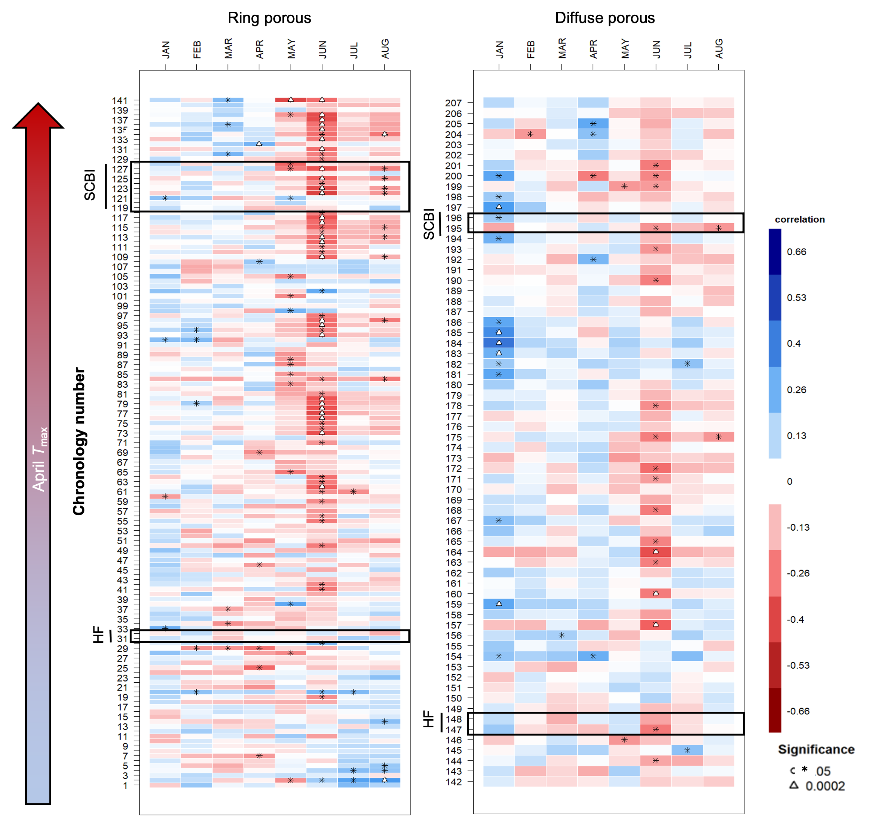

```{r eval = TRUE, echo=FALSE, warning=FALSE, results='hide'}
path_to_results <- paste0(dirname(dirname(getwd())), "/results/") #I was trying to read directly from results folder, but couldn't get it working.

# SUPPLEMENTARY INFO (copied from Dow_manuscript.Rmd)
##SI table numbers
table_species="S1"  
sample_size_by_species= "S2"
sample_size_by_year= "S2"
mean_growth_parameters_table="S3" 
chronologies_table="S4" #!!! Hand-numbered in tree-ring figure captions

#SI figure numbers
growth_curves_all = "S1"  
climwin = "S2"
tree_rings_TMIN = "S3"

#SI table captions
species_table_caption <-"Table S1 | Dominant ring- and diffuse-porous species at the Smithsonian Conservation Biology Institute (SCBI) and Harvard Forest, along with sample sizes included in this analysis."
sample_size_by_year_caption <- "Table S2 | Sample size by year "
mean_growth_parameters_caption = "Table S3 | Summary of parameters describing the phenology and rate of growth for ring- and diffuse- porous species at SCBI and Harvard Forest. "

#SI figure captions
growth_curves_all_caption  <- " Figure S1 | Growth trajectories for ring- and diffuse-porous trees, as both relative and cumulative fractions of total annual growth. Each line represents one year's growth for a given tree, fit with McMahon model. "

climwin_caption <- "Figure S2 | Landscapes of relationships between the day of year on which 25% of annual growth is achieved ($DOY_{25}$) and temperature in prior weeks for ring- and diffuse-porous trees at SCBI and Harvard Forest. Shown are matrices of linear coefficients of first-order linear regressions between temperature and $DOY_{25}$, where Window Open and Window Close indicate number of weeks prior to $DOY_{25}$ (ring-porous: May 5 at SCBI, May 13 at HF; diffuse-porous: June 4 at SCBI, June 14 at HF). Black circles indicate the critical $T_{max}$ window (ring-porous:  March 22- April 9 at SCBI, April 2 - May 07 at HF; diffuse-porous: Feb. 19- May 21 at SCBI, March 19 - May 07 at HF)."

tree_rings_TMIN_short_caption <- "Figure S3 | Sensitivity of annual growth, as derived from tree-rings, to monthly minimum temperatures, for ## chronologies from ## sites across eastern North America. Chronologies are grouped by xylem porosity and ordered by mean April T_max. Chronology details are given in Table S4. (**NOTE: Figure still needs some work. Chronology numbers are off.**  See [GitHub Issue #49](https://github.com/EcoClimLab/growth_phenology/issues/49).)"


```


\newpage

```{r species_table, eval=TRUE, echo=FALSE, warning=FALSE}
library(knitr)
library(kableExtra)
species_table <- read.csv(file = "tables_figures/species_table.csv", col.names = c("site", "xylem porosity","species", "species code", "n trees", "n tree-years", "n cores", "date range"),  stringsAsFactors = FALSE, check.names = FALSE)
kable(species_table, caption = species_table_caption ,  format = "latex", booktabs = TRUE,  escape = F) %>%
add_header_above(c(" ", " ", " ", " ", "dendrometer bands" = 2, "tree cores"=2 )) %>%
  pack_rows("", 1, 9, latex_gap_space = "1em", colnum = 4, hline_before = FALSE) %>%
  pack_rows("", 10, 11, latex_gap_space = "1em", colnum = 4, hline_before = FALSE) %>%
  pack_rows("", 12, 14, latex_gap_space = "1em", colnum = 4, hline_before = FALSE) %>%
  pack_rows("", 15, 22, latex_gap_space = "1em", colnum = 4, hline_before = FALSE) %>%
kable_styling(latex_options = c("scale_down", "hold_position"), protect_latex = T) 
```

\newpage

```{r, Table sample_size_by_year, eval=TRUE, echo=FALSE, message=FALSE, fig.pos="H"}
library(knitr)
library(kableExtra)
table <- read.csv("tables_figures/sample_size_by_year.csv",stringsAsFactors = FALSE, check.names = FALSE)
kbl(table, caption = sample_size_by_year_caption, format = "latex", booktabs = T) %>%
  kable_styling(latex_options = "hold_position")
```

\newpage

```{r mean_growth_parameters_table,  eval=TRUE, echo=FALSE, warning=FALSE}
library(knitr)
library(kableExtra)
mean_growth_parameters <- read.csv("tables_figures/mean_growth_parameters.csv",  col.names = c("", "ring","diffuse","ring", "diffuse"), stringsAsFactors = FALSE, check.names = FALSE)
kable(mean_growth_parameters, caption = mean_growth_parameters_caption ,  format = "latex", booktabs = TRUE,  escape = F) %>%
add_header_above(c(" ",  "SCBI" = 2, "Harvard Forest"=2 )) %>%
    column_spec(1, width = "4cm") %>%
     pack_rows("Stem Growth", 1, 8, latex_gap_space = "1em", colnum = 4, hline_before = FALSE) %>%
    pack_rows("Leaf Phenology (ecosystem level)", 9, 12, latex_gap_space = "1em", colnum = 4, hline_before = FALSE) %>%
    #add_indent(9:12)
kable_styling(latex_options = c("scale_down", "hold_position"), protect_latex = T) 
```

\newpage
# (placeholder for chronologies table.)

\newpage

```{r growth_curves_all, out.width="100%", echo=FALSE, fig.align="center", fig.cap= growth_curves_all_caption, fig.pos="H", warning=FALSE}
knitr::include_graphics("tables_figures/growth_curves_all.png")
```

\newpage
```{r climwin, out.width="70%", echo=FALSE, fig.align="center", fig.cap= climwin_caption, warning=FALSE}
knitr::include_graphics("tables_figures/climwin_figure.png")
```


\newpage
```{r tree_rings_TMIN, out.width="120%", echo=FALSE, fig.align="center", fig.cap= tree_rings_TMIN_short_caption, fig.pos="H", warning=FALSE}

```

