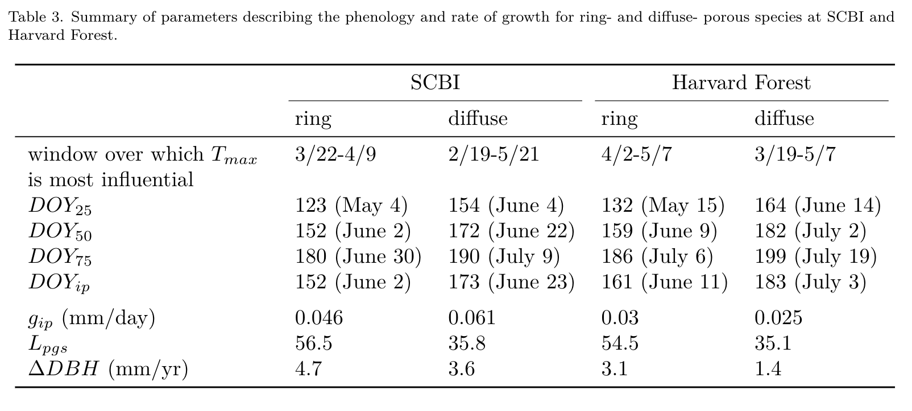

```{r setup, include=FALSE}
knitr::opts_chunk$set(echo = TRUE)
```


\raggedright

**Title:** Warmer spring temperatures in temperate deciduous forests cause earlier tree growth but have little effect on annual woody productivity

**Authors (not yet complete, just alphabetical for now--final order TBD):** 

Cameron Dow^1^

Albert Y. Kim^1,2^

Loïc D’Orangeville^3,4^

Erika B. Gonzalez-Akre^1^

Ryan Helcoski^1^

Valentine Herrmann^1^

Ian McGregor^1,5^

William McShea^1^

Sean McMahon^6,7^

David A. Orwig^3^

Neil Pederson^3^

Kristina J. Anderson-Teixeira^1,7^*


**Author Affiliations:**

1. Conservation Ecology Center; Smithsonian Conservation Biology Institute; Front Royal, VA 22630, USA

2. Statistical & Data Sciences; Smith College; Northampton, MA 01063, USA

3. Harvard Forest, Petersham, MA 01366, USA

4. Faculty of Forestry and Environmental Management, University of New Brunswick, Fredericton, NB, E3B 5A3, Canada.

5. NCSU

6. SERC

7. Center for Tropical Forest Science-Forest Global Earth Observatory; Smithsonian Tropical Research Institute; Panama, Republic of Panama


*corresponding author: teixeirak@si.edu; +1 540 635 6546


```{r eval = TRUE, echo=FALSE, warning=FALSE, results='hide'}
## potential reviewers: Zani

## Target journal: Global Change Biology
## Instructions for authors: https://onlinelibrary-wiley-com.smithsonian.idm.oclc.org/page/journal/13652486/homepage/forauthors.html
## Primary Research Articles present the results of a completed research project and are up to 8000 words in length. Word limits apply to the main body of the text (Introduction, Materials and Methods, Results, Discussion, and Acknowledgements).

## I don't think GCB has an official limit. I just saw a recently accepted article with 10 figures and 4 tables, so we're fine!

#Figures & Tables: listing figures and their number here is helpful for planning, and also allows automatic numbering within text -->easy changing of order. 

#Table numbers
hypothesis_table=1
table_species=2
mean_growth_parameters_table=3

#Figure numbers
schematic=1 #illustrates parameters
growth_curves_all = 2  
    rel_growth_SCBI = "2a" 
    rel_growth_HF = "2b" 
    cum_growth_SCBI = "2c" 
    cum_growth_HF = "2d" 
climwin = 3
pheno_Tsensitivity = 4
DOYtiming = 5
DOYtiming_SCBI = "5a"
DOYtiming_Harvard = "5b"
tree_rings = 6

#figure captions

schematic_caption <- "Figure 1. Schematic illustrating the parameters considered here. Shown are measurements for an example tree (## cm SPECIES), fit with the model of McMahon & Parker (2015), from which phenology and growth rate parameters are obtained."

growth_curves_all_caption  <- "Figure 2. Growth trajectories for ring- and diffuse-porous trees, as both relative and cumulative fractions of total annual growth. Each line represents one year's growth for a given tree, fit with McMahon model."

climwin_caption <- "Figure 3. Landscapes of relationships between the day of year on which 25% of annual growth is achieved ($DOY_{25}$) and temperature in prior weeks for ring- and diffuse-porous trees at SCBI and Harvard Forest. Shown are matrices of linear coefficients of first-order linear regressions between temperature and $DOY_{25}$, where Window Open and Window Close indicate number of weeks prior to $DOY_{25}$ (ring-porous: May 5 at SCBI, May 13 at HF; diffuse-porous: June 4 at SCBI, June 14 at HF). Black circles indicate the critical $T_{max}$ window (ring-porous:  March 22- April 9 at SCBI, April 2 - May 07 at HF; diffuse-porous: Feb. 19- May 21 at SCBI, March 19 - May 07 at HF)."


pheno_Tsensitivity_caption <- "Figure 4. Relationship between growth parameters and climwin mean temperatures. For each 
observed climwin mean temperature value, the posterior mean of the fitted day of year
is represented by the solid blue line and 95% credible intervals are represented by bands."

DOYtiming_caption <- "Figure 5. Day of year where growth milestones were achieved at (a) the Smithonian Conservation Biology Institute and (b) Harvard Forest. Each line represents a single year of ring-porous (dotted line) or diffuse-porous (solid line) trees at each site. Mean temperature was calculated for each wood-type/site combination over the respective critical $T_{max}$ window, then turned into a ratio and assigned a color on a gradient where the coldest year in the sample is blue and the warmest is red."

tree_rings_caption <- "Figure 6. Climate sensitivity of annual growth, as derived from tree-rings, for dominant ring- and diffuse- porous species at the Smithsonian Conservation Biology Institute and Harvard Forest. Shown are Pearson correlations between ring-width index and and monthly Tmax. Species codes are as given in Table 2."

# SUPPLEMENTARY INFO (this chunk must be repeated in Dow_SI.Rmd)
#SI table numbers
sample_size_by_year= "S1"

#SI table captions
sample_size_by_year_caption <- "Table S1. Sample size by year"

#SI figure numbers
all_climwin_SI_figs = " S1-S4"
climwin_rp_DOY25_SCBI = "S1"
climwin_dp_DOY25_SCBI = "S2"
climwin_rp_DOY25_HARV = "S3"
climwin_dp_DOY25_HARV = "S4"
tree_rings_TMIN = "S5"

#SI figure captions
climwin_rp_DOY25_SCBI_short_caption <- "Figure S1. Full climwin output for $DOY_{25}$ for ring porous species at SCBI."
climwin_dp_DOY25_SCBI_short_caption <- "Figure S2. Full climwin output for $DOY_{25}$ for diffuse porous species at SCBI."
climwin_rp_DOY25_HARV_short_caption <- "Figure S3. Full climwin output for $DOY_{25}$ for ring porous species at Harvard Forest."
climwin_dp_DOY25_HARV_short_caption <- "Figure S4. Full climwin output for $DOY_{25}$ for diffuse porous species at Harvard Forest."
tree_rings_TMIN_short_caption <- "Figure S5. ..."

## some stats/ 
species_table <- read.csv(file = "tables_figures/species_table.csv")
n_dendro_trees <- sum(na.omit(species_table[, "n.trees"]))
n_tree_years <- sum(na.omit(species_table[, "n.tree.years"]))
n_cores <- sum(na.omit(species_table[, "n.cores"]))

```


\newpage

# Abstract
```{r eval=FALSE, echo=FALSE}
## For GCB:
## Abstract limit for GCB is 300 words. 
## 6-10 keywords

```


As the climate changes, warmer spring temperatures are causing earlier leaf-out in temperate deciduous forests, along with earlier initiation of the annual period where these ecosystems are net sinks of carbon dioxide (CO~2~).
As a result, there is a tendency towards increased growing season length and annual CO~2~ sequestration.
However, little is known about how spring temperatures affect tree stem growth, which consumes a modest portion of the carbon fixed annually but is critical in that wood has a long residence time in the ecosystem.
We need to know how the timing and rate of woody growth are affected by warming spring temperatures.
Here, we show that in two temperate deciduous forests warmer maximum temperatures in the spring shift growth milestones earlier in the year, but have only a modest effect on peak growing season length and little effect on annual growth.
This contrasts with the expectation *in most models* that an earlier start to growing season would significantly increase the rate of biomass accumulation and thereby enhance the CO~2~ sink of temperate deciduous forests.
It is, however, consistent with most tree-ring studies in temperate deciduous forests showing that annual growth tends to be more sensitive to climatic conditions during the peak growing season than in the spring, with eddy-covariance records showing that annual CO~2~ sequestration is more strongly linked to conditions in the peak growing season than to growing season length, and with evidence that forest CO~2~ sequestration is sink-limited.
Thus, our findings indicate that warming spring conditions are unlikely to impact temperate deciduous forest growth sufficiently to produce any substantial negative climate change feedback.

**Keywords**:  

\newpage


# Introduction

## (forests are critical for climate change regulation, so we need to understand better how they're responding to climate change)
As global atmospheric greenhouse gas levels are rising, and little meaningful policy is being implemented in response, our planet is expected to surpass the 2.5 degree C warming mark that the Paris accord pledged to avoid. The absence of human intervention increases our reliance on natural systems to soften the blow of climate change. Plant life, especially forests, make up a large portion of these natural systems, offering many valuable ecosystem services. For one, they house an astonishing 80% of terrestrial species and are capable of removing the greenhouse gas CO2 from the atmosphere and storing it in the trees or soil. Forests sequester about one-third of all anthropogenic CO~2~ and store ~45% of all terrestrial carbon [@bonan_forests_2008]. However, their future under the current era of rapid change is uncertain [@friedlingstein_climatecarbon_2006]. 

Reducing this uncertainty requires better understanding of the drivers of tree growth [@bugmann_tree_2019]. Tree growth is sensitive to climatic factors like precipitation, temperature, and cloudiness in early growing season [@Helcoski_growing_2019]; [@Ciais_europe-wide_2005]; [@Goulden_exchange_1996], as well as other physical factors including nitrogen content of soil, increasing atmospheric CO~2~, deposition of atmospheric pollutants in acid rain [@mathias_disentangling_2018], and invasion by pests or pathogens. Understanding how growth is influenced by these factors is essential for developing accurate models to inform forest managers and policy makers about the role of future forests in climate change mitigation efforts.

## (spring temperatures are rising, and this is affecting leaf phenology and carbon cycling)
In recent decades, an increase in average spring temperature has been impacting many natural systems including forests ([@parmesan_globally_2003]; [@zhizong_fingerprinting_2006]). 
The effects of this spring warming are most apparent when examining leaf phenology shifts, *which have been extensively studied ([@way_tree_2011]; [@klosterman_later_2018]), leading to many critical observations*. For example, some regions have seen earlier leaf out in deciduous trees, which is often matched or exceeded by delays in leaf senescence timing, when springtime temperatures are above average [@ibanez_forecasting_2010];@jeong_phenology_2011];@crabbe_extreme_2016]. The emergence of leaves signals the beginning of carbon sequestration or in other words, the growing season of a tree. It is believed that the longer the tree has leaves - or as the growing season is extended - the net annual carbon sequestered will increase as well (*i,e*, net ecosystem exchange, $NEE$; @churkina_spatial_2005; @keenan_net_2014; @zhou_explaining_2016].) 

However, more of the interannual variation in forest $NEE$ is explained by variation in maximum C uptake rates than by the length of the carbon uptake period [@zhou_explaining_2016; @fu_maximum_2019]. This implies that earlier leafout will lead to smaller increases in NEE than changes in other phenological traits like the maximum C uptake rate. This idea agrees with patterns seen in tree cores, where peak growing season climate was more influential than spring climate [@Helcoski_growing_2019] but many models still predict the extension of growing season will increase NEE. A paper by @zani_increased_2020 found that earlier leaf out led to earlier leaf senescence within the deciduous trees in their study, reducing the ability of the trees to sequester significantly higher levels of C. Instead they posit that senescence is induced when seasonal carbon-sink capacity of the tree is reached, no matter how extended the potential growing season is. This result directly contradicts those previous predictions that warmer Spring temperatures and earlier leaf out will lead to drastically increased C sequestration. 

Thus, while it is increasingly clear that warming spring temperatures lengthen the growing season and modestly increase annual carbon sequestration, indirect observations of these effects - like those involving leaf phenology - are not enough to draw firm conclusions on the future of forests. Instead, direct observations of intraannual stem-growth should be compared between years with a variety of spring climate conditions so a clearer relationship between climate and stem-growth can be deciphered. Looking directly at the stem-growth is advantageous as it allows examination of individual trees as opposed to larger landscape scale patterns obtained through eddy-covariance or remote sensing studies. A direct, fine scale, individual based study would allow a look into the effect of warming springtime on stem-growth phenology and the related shifts in growing season length and $NEE$.

## (However, we don't know how warming springs affect stem-growth, which matters because the C allocated to stem growth will be retained in the ecosystem for decades to millenia )
Earlier timing of spring leaf-up and initiation of carbon sequestration signals that these trees are shifting their growth windows in response to increasing spring temperatures, but to date, very little research on the characteristics of stem-growth during this shift has been done. 
In fact, we know little about the stem-growth phenology of temperate deciduous species — let alone how these are affected by changes in spring temperature patterns. *(but check into this.... I suspect there may be some that we're missing--perhaps auto dendro bands in Europe. Neil did say that there's little on early spring T)*. 

Tree-ring records give some hints that warmer springs may increase annual growth ([@Helcoski_growing_2019]; probably some more), but tree-rings tell us nothing about the timing of that growth. Similarly, large scale observations of leaf-phenolgy and eddy-covariance also hint that warmer springs increase annual growth but tell us little about the maximum C uptake rates, or interspecific differences in total carbon sequestered. 

## (We also know little about differences across species or functional groups, which matters because it will affect how different species fare under climate change )
Leaf and wood phenology traits, along with their apparent relationships, are dissimilar among trees of different wood types (ring-porous and diffuse-porous; **D'Orangeville et al. **). Interspecific variation of this sort likely stems from evolutionary differences and adaptations to local climates where these trees can be found. Ring-porous trees have large xylem cells which are prone to embolism during the winter. These cells are repaired before leaf development in the Spring, corresponding with an earlier initiaiton of stem-growth. Diffuse-porous xylem cells are smaller, and less prone to embolism during the Winter, meaning they do not need to be repaired in order to restore hydraulic functionality before beginning the leaf development process. Results from the paper by D’Orangeville et al. (in review) have shown that ring-porous trees reach 25 and 50% of their total yearly growth during spring, while diffuse-porous trees reach these milestones in the summer, but both reached 75% total annual growth around the same time. If leaf development is sped up when spring temperatures are warmer, we should seek to understand how this shift influences stem-growth timing and other phenological variables. 


## (Here, we...)
Here, we characterize how early spring temperatures affect stem growth phenology and rates of temperate deciduous trees within two forest dynamics plots in the Eastern USA. Using data from dendrometer bands measured throughout the growing season, we fit a growth model to the time series of individual trees to determine the day of year where 25, 50, and 75% annual growth was achieved ($DOY_{25}$, $DOY_{50}$, $DOY_{75}$); maximum growth rates ($g_{max}$) and the DOY on which they occurred ($DOY_{g_{max}}$); total annual growth ($\Delta DBH$); and peak growing season length ($DOY_{75}$-$DOY_{25}$; $L_{pgs}$) [Fig. `r schematic`; @mcmahon_general_2015]. We test the hypotheses that (1) warmer early springs result in earlier stem growth and a longer period of growth, but (2) maximum growth rates are independent of spring temperatures, and as a result (3) total annual growth increases in response to warmer spring temperatures (Table `r hypothesis_table`).

```{r schematic, out.width="100%", echo=FALSE, fig.align="center", fig.cap= schematic_caption}
# Created in RScripts/additional_figures.R
knitr::include_graphics("tables_figures/schematic.png")
```


```{r hypothesis_table, eval=TRUE, echo=FALSE, warning=FALSE}
knitr::include_graphics("tables_figures/hypothesis_table.png")
```


# Materials and Methods

## Study sites

Study sites included two temperate forests in the eastern United States, both part of the Forest Global Earth Observatory [ForestGEO; Anderson-Teixeira et al. 2015; Davies et al. 2021]. 

Our first study site was the forest dynamics plot located at the Smithsonian Conservation Biology Institute 5 km South of Front Royal, Virginia within the Blue Ridge Mountains (38.8935° N, 78.1454° W; elevation 273–338 m.a.s.l.). 
The forest here was established in the mid-19th century after conversion from agricultural fields. 
Dominate canopy species within the 25.6 ha forest plot include tulip poplar (*Liriodendron tulipifera*), oaks (*Quercus spp.*), hickories (*Carya spp.*). 
The climate is humid temperate, with a mean annual precipitation of 998 mm and temperatures averaging 1° C in January and 24° C in July ([@Helcoski_growing_2019]).  

The second study site was Harvard Forest (42.5388° N, 72.1755° W, 340-368 m.a.s.l.), located near the central Massachusetts town of Petersham.
Harvard forest is a secondary forest, having re-established following agricultural use *(time frame)* and signficant hurricane damage in *YEAR*. 
Dominate species within the 35 ha ForestGEO plot are hemlock (*Tsuga spp.*), oak (*Quercus spp.*) and maple (*Acer spp.*). 
The climate is temperate continental with a mean annual precipitation of 1120 mm and temperatures  averaging -12° C in January and 19° C in July (D'Orangeville et al, ).

## Data collection and preparation
### Dendrometer bands

Metal dendrometer bands installed on a total of `r n_dendro_trees` trees within the SCBI and Harvard Forest ForestGEO plots (Table `r table_species`). 
Bands were placed on dominant species, including two diffuse- and two ring-porous species at SCBI and eight diffuse- and three ring-porous species at Harvard Forest.
Bands were measured with a digital caliper approximately every 1-2 weeks within the growing season from 2011-2020 at SCBI and 1998-2003 at Harvard Forest, respectively. 
The number of bands measured at each site fluctuated somewhat as trees were added or dropped (e.g., because of tree mortality) from the census (Table `r sample_size_by_year`) *(tags_per_year_preclean in data folder)*. 
Across years, the number of bands sampled averaged *~135* (range: 99-145) at SCBI and  *~717* (range: *700-755*) at Harvard Forest. 
In total, our analysis included `r n_tree_years` tree-years (Table `r table_species`).


```{r species, eval=TRUE, echo=FALSE, warning=FALSE}
knitr::include_graphics("tables_figures/species_table.png")
```


Measurements were timed to begin before the beginning of spring growth and to continue through the cessation of growth in the fall. 
At SCBI, the median start date was 4/14, which was adjusted when early leaf-out of understory shrubs and herbs was observed, with the earliest start date being March 30, 2020. Measurements were continued through to fall leaf senescence, with the median end date being 10/17 and the latest end date was November 26, 2012. 
Timing of measurements at Harvard Forest was similar, with the median start date of 4/23 and median end date of 10/30. 1998 was an anomalous year where initial measurements were taken on 1/5, but not taken again until 4/15. The latest end date was November 11, 2002.

The dendrometer band data were manually cleaned by visual inspection before analysis. 
We screened for three classes of mistakes. 
First, when a weekly measurement was drastically different from previous week and following weeks, this was assumed to be a measurement error and the record was removed.
Second, when measurements remained essentially unchanged for several readings, followed by a sudden jump followed by normal growth pattern, this was assumed to be a case where the band was stuck and then released. In these cases, the full annual record for the tree was removed.
Third, there were cases where data were clearly wrong but with unknown causes. In cases where several measurements were an issue, they were simply removed. If there were no clear solutions to ‘fix’ the data, the entire year was removed from the analysis.

We fit the model of @mcmahon_general_2015 to define phenological dates and growth rates (Fig. `r schematic`). 
This five-parameter logistic model was fitted to dendrometer band data from each tree-year in R: 
$$ DBH = L + \frac{K - L} { 1 + 1/\theta \cdot exp[-r(DOY - DOY_{ip}) / \theta)] ^ \theta}$$ 
Here, $L$ and $K$ are lower and upper asymptotes of the model, corresponding to $DBH$ at the beginning and end of the year, respectively. 
$DOY$ are the modeled days of year (*i.e.*, julian days), 
$DOY_{ip}$ is the day of year where the inflection point in growth rate occurs,
$r$ *shapes the slope of the curve at the inflection point*,
and $\theta$ is a tuning parameter controlling the slope of the curve toward the upper asymptote. 
*We note that the DOY on which maximum growth occurs, $DOY_{g_{max}}$ (Fig. `r schematic`) occurs on $DOY_{ip}$ only when $\theta = 1$.*
Using the optimized parameters for each tree-year, we then modeled $DBH$ throughout the year and extracted the intra-annual growth variables of interest (Fig. `r schematic`). 

After fitting the @mcmahon_general_2015 model, we used a script to remove poorly fit models. 
Models were judged to be poorly fit if certain modeled growth characteristics fell outside of the acceptable range we determined. 
Modeled fits for tree-years were removed under five conditions:
(1) single day growth rates were higher than 2 standard deviations away from the mean for each wood-type (SCBI = 2, HF = 34); 
(2) $DOY_{ip}$ was $\ge 2$ standard deviations away from the mean for it's xylem architecture group, year, and site (SCBI = 62, HF = 106); 
(3) tree-years with small or negligible total growth ($\Delta DBH$ < 0.02 mm; SCBI = 0, HF = 66); 
(4) model fit predicted total yearly growth to take longer than 365 days, indicating poor model fit (SCBI = 181, HF = 199); 
and (5) models with unexplained sharp spikes in growth rate (SCBI = 0, HF = 3). 
At Harvard Forest the tag years removed through this method was proportional to the original sample size, indicating that no species or size class was disproportionately removed compared to others *(SI figure? data_cleaning_figure_hf in manuscript folder)*. 
At SCBI a higher proportion of RP trees were removed--the majority in step 4 *(data_cleaning_figure_scbi)*. 

### Tree-rings
Dominant tree species were cored at both sites following sampling designs that covered a broad range of $DBH$.
We analyzed records for the dominant ring- and diffuse- porous species at each site (Table `r table_species`), excluding species with other xylem architectures (*Juglans nigra* L. at SCBI, *Tsuga Canadensis* (L.) Carrière at Harvard Forest)
At SCBI, cores were collected as described in @helcoski_growing_2019. 
Briefly, cores were taken from living or recently dead trees $\ge$ 10 cm $DBH$, including a randomly sampled subset of all dominant species within the ForestGEO plot [live trees in 2010-2011; @bourg_initial_2013] and trees found newly dead in annual tree mortality in 2016 and 2017 [@helcoski_growing_2019].
At Harvard Forest, ...(*Neil can write this easily, or KAT probably has the info*)
In total, we analyzed `r n_cores` cores from eleven species at SCBI and three species at Harvard Forest (Table `r table_species`).

All cores were mounted, sanded, cross-dated, and measured using standard methodology. 
We standardized ring-width series from each core via ARSTAN using a 2/3rds $n$ spline, where $n$ is the number of years in the series [@cook_time_1985; @cook_methods_1990]. 
*(The following italic text is self-plagarized from Helcoski and needs to be reworded:)* *The influence of outliers in all series was reduced using the adaptive power transformation, which also stabilises the variance over time [@cook_calculating_1997]. Next, each series was stabilised using either the average correlation between raw ring-width series (rbar) method or a 1/3rds spline method to adjust changes in variance as series replication decreased towards the earlier portion of each chronology [@jones_estimating_1997]. The 1/3rds spline method was chosen when replication in the inner portion of each chronology (c. the inner 30–50 yr of each record depending on full chronology length) dropped below three trees. Once that step was complete, a robust biweight mean chronology for each species was calculated from the ring-width indices [@cook_time_1985]. We chose to use residual chronologies because the autoregressive standardisation process in creating them removes much of the tree-level autocorrelation in growth and these chronologies would most likely contain the most conservative information on drivers of interannual growth [@cook_time_1985].* 
We defined chronology start year (Table `r table_species`) as the year where subsample signal strength (SSS) passed a threshold of SSS = 0.8, or where $\ge$ 80% of the population signal was captured in the chronology.

### Climate
For the dendrometer band analysis, we used climate data from local weather stations. 
Daily maximum and minimum temperatures ($T_{max}$ and $T_{min}$, respectively) for SCBI were obtained from a meteorological tower adjacent to the SCBI ForestGEO plot, via the ForestGEO Climate Data Portal v1.0 [https://forestgeo.github.io/Climate/; @anderson-teixeira_forestgeoclimate_2020]. 
Daily temperature records for Harvard Forest were obtained from the Harvard Forest weather station (Boose & Gould, 2004; Boose, 2018).
The R package climpact () was used to plot temperatures for visual inspection. 
Climpact also identifies readings that were greater than 3 standard deviations away from yearly means. These points were labeled as outliers and removed from the dataset. 
Gaps in the SCBI meteorological tower data were subsequently filled using temperature readings obtained from a National Center for Environmental Information (NCEI) weather station located in Front Royal, Virginia (https://www.ncdc.noaa.gov/cdo-web/datasets/GHCND/stations/GHCND:USC00443229/detail). 
(*how were gaps filled for Harvard? Or was the record good?*)

For the tree-ring analysis, we obtained monthly $T_{max}$ and $T_{min}$ data for 1901-2019 from CRU v.4.04 [@harris_version_2020], again via the ForestGEO Climate Data Portal v1.0 [@anderson-teixeira_forestgeoclimate_2020].

## Determining critical temperature windows

The period where the phenology milestone(s) were most affected by changes in early spring temperature was determined using the R package *climwin* [@van_de_pol_identifying_2016]. 
This package tests the correlation between one or more climate variables and a biological variable over all consecutive time windows within a specified time-frame, reporting correlation and \$Delta AIC$ of each window. 
Here, we tested for correlation between temperature ($T_{max}$, $T_{min}$) and $DOY_{25}$ over the time window from January 1 to the mean $DOY_{25}$ for the species group and site (Table `r mean_growth_parameters_table`).
*The critical time window is determined based on the subset of models that fall within the 95% confidence set.*
Here, we focused on defining critical temperature windows for $DOY_{25}$, as opposed to other growth phenology parameters (Figure `r schematic`), because we were interested in the influence of temperature on the initiation of woody growth. 
We note that other growth parameters would be controlled by different critical temperature windows; for example, at SCBI $\Delta DBH$ responds most strongly to May-July climate [@helcoski_growing_2019]. Determining the climate variables that most strongly control all parameters is beyond the scope of this analysis.


## Hypothesis testing

(*This section needs more detail.*)

Correlation between these variables and spring temperatures were assessed using a linear mixed model in a hierarchical Bayesian framework.

Mixed effects models were used to test the response of growth phenology variables ($DOY_{25}$, $DOY_{50}$, $DOY_{75}$, $DOY_{g_max}}$, $g_{max}$, and $\Delta DBH$) to fixed effects of xylem porosity and mean temperature ($T_{max}$, $T_{min}$) during the critical temperature window selected by *climwin*, along with random effects of species and tree. 
We ran separate models for each species group at each site, and for the response of all growth phenology variables to $T_{max}$ and $T_{min}$. 
Models were run using the LME4 package in R [@bates_fitting_2015]. 

This mixed-effect model was run within a hierarchical Bayesian framework and fit using the `rstanarm` R interface to the Stan programming language @rstanarm_2020. In all cases unless otherwise specified, all prior distributions are set to be the weakly informative defaults. 
<!--
TODO added by Bert: Whereever we specify model details, include details about prior from here:
https://cran.r-project.org/web/packages/rstanarm/vignettes/priors.html#default-weakly-informative-prior-distributions
-->


# Results

## Phenological patterns

Across all trees and years at SCBI, 
25% of annual growth was achieved on May 20 ($DOY_{25}$=139), 
50% on June 12 ($DOY_{50}$=162), 
and 75% on July 5 ($DOY_{75}$=185), 
for an average peak growing season length of 45 days. 
Maximum growth rate occurred just one day after $DOY_{50}$ on June 13 ($DOY_{max}$=163). 
At Harvard Forest,
25% of annual growth was achieved on June 1 ($DOY_{25}$=151), 
50% on June 23 ($DOY_{50}$=173), 
and 75% on July 14 ($DOY_{75}$=194), 
for an average peak growing season length of 43 days. 
Maximum growth rate occurred on June 24 ($DOY_{max}$=174). 

At both sites, growth phenology differed between ring- and diffuse- porous species (Fig. `r growth_curves_all`, Table `r mean_growth_parameters_table`). 
Specifically, ring-porous species began growing earlier, reaching the $DOY_{25}$ benchmark `r 154-123` days earlier at SCBI and `r 164-132` days earlier at Harvard Forest. 
Growth of ring-porous species was spread out over a longer growing season, with average $L_{PGS}$ of ring-porous species being 21 days longer at SCBI and 19 days longer at Harvard Forest. 
Growing season length was similar across sites, with $L_{PGS}$ being, on average, only two days longer at SCBI for ring-porous species and <1 day longer for diffuse-porous species. 


```{r growth_curves_all, out.width="100%", echo=FALSE, fig.align="center", fig.cap= growth_curves_all_caption}
# Created in RScripts/additional_figures.R
knitr::include_graphics("tables_figures/growth_curves_all.png")
```


```{r mean_growth_parameters_table, out.width="100%", echo=FALSE, fig.align="center"}

```

## Critical temperature windows

For the majority of weekly time windows from Jan. 1 to $DOY_{25}$, there was a negative or neutral relationship between $T_{max}$ and $DOY_{25}$, meaning that warmer temperatures shifted growth earlier in the season (Figs. `r climwin`, `r all_climwin_SI_figs`). 
This held true for both ring- and diffuse-porous trees at both sites, *albiet* with less consistent patterns at Harvard Forest, which was sampled for fewer years. 
The strongest relationships, including but not limited to the optimal time windows (Table `r mean_growth_parameters_table`), occurred for time windows closing $\le$ 5 weeks prior to $DOY_{25}$. 

```{r climwin, out.width="80%", echo=FALSE, fig.align="center", fig.cap= climwin_caption}
# Created in RScripts/additional_figures.R
knitr::include_graphics("tables_figures/climwin_figure.png")
```

The correlation of $DOY_{25}$ to $T_{min}$ was less consistent than that of $T_{max}$ (Figs. `r climwin`, `r all_climwin_SI_figs`). 
At SCBI, patterns were quite similar to those described above for $T_{max}$, with similar timing and strengths of correlations across the two temperature variables (Figs. `r climwin_rp_DOY25_SCBI` - `r climwin_dp_DOY25_SCBI`).
In contrast, at Harvard Forest, where we had only six years of data, *climwin* selected windows, both > 5 weeks prior to $DOY_{25}$, had positive correlations between $DOY_{25}$ and $T_{min}$.
However, for both ring- and diffuse- porous species, average $T_{min}$ of the selected period was below freezing (<0° C) in all years, suggesting that these are sporadic correlations that are unlikely to be biologically meaningful.

Henceforth, we focus on $T_{max}$.

## Climate sensitivity of phenology 

For both ring- and diffuse- porous species at both sites, warmer spring $T_{max}$ resulted in earlier achievement of growth milestones (Tables `r hypothesis_table`, Figs. `r pheno_Tsensitivity`, `r DOYtiming`).
Specifically, $DOY_{25}$, $DOY_{50}$, and $DOY_{g.max}$ at SCBI and $DOY_{25}$, $DOY_{50}$, $DOY_{75}$, and $DOY_{g.max}$ at Harvard Forest all decreased significantly with increasing $T_{max}$ during the critical temperature window (Table `r hypothesis_table`, `r pheno_Tsensitivity`, `r DOYtiming`).

```{r pheno_Tsensitivity, out.width="80%", echo=FALSE, fig.align="center", fig.cap=pheno_Tsensitivity_caption}
# Created in RScripts/bert/wood_phenology_analysis_bert.R
knitr::include_graphics("tables_figures/pheno_Tsensitivity_combo.png")
```

```{r DOYtiming, out.width="100%", echo=FALSE, fig.align="center", fig.cap= DOYtiming_caption}
# Created in RScripts/additional_figures.R
knitr::include_graphics("tables_figures/DOYtiming_allyears.png")
```

For three of the four species group-site combinations (exception: ring-porous at Harvard Forest), warmer $T_{max}$ during the critical temperature window resulted in increased $L_{PGS}$ (Tables `r hypothesis_table`, Figs. `r pheno_Tsensitivity`, `r DOYtiming`).
At SCBI, ring-porous $DOY_{25}$ and $DOY_{50}$ shifted earlier as a result of warmer springs whereas ${DOY_75}$ did not shift significantly, resulting in a positive correlation between $L_{PGS}$ and $T_{max}$ during the critical temperature.
For diffuse-porous species at both SCBI and Harvard Forest, all growth milestones occurred earlier in warmer springs, but $DOY_{25}$ was more strongly affected than ${DOY_75}$, resulting in increased $L_{PGS}$.
At Harvard Forest,  all growth milestones occurred earlier in warmer springs, but ring-porous ${DOY_75}$ shifted more than ${DOY_25}$, resulting in shorter peak growing season length.  

## Climate sensitivity of growth

Maximum growth rate, $g_{max}$, was not consistently linked to early spring temperatures (Tables `r hypothesis_table`, Fig. `r pheno_Tsensitivity`). 
Ring-porous species exhibited no change (SCBI) or a slight increase (Harvard Forest) with warmer $T_{max}$ during the critical temperature window.
In contrast, diffuse-porous species at both sites exhibited lower $g_{max}$ in years with higher early spring $T_{max}$.

Total annual growth was not consistently linked to spring temperatures (Table `r hypothesis_table`).
Annual growth measured with dendrometer bands, $\Delta DBH$, also was not consistently linked to early spring temperatures, displaying either no relationship (SCBI) or extremely small changes in opposite directions for ring- and diffuse- porous species (Harvard Forest) (Fig. `r pheno_Tsensitivity`).

Similarly, between species-level residual chronologies rarely exhibited significant correlations to either $T_{max}$ or $T_{min}$ in the months corresponding to the critical temperature windows identified here (Figs. `r tree_rings`, `r tree_rings_TMIN`).
Although correlations were rarely significant, there was a consistent pattern in responses to $T_{max}$ across all species at both sites:
responses to $T_{max}$ were negative or neutral in all months from February to August, with the exception of one spring month at each site (April at SCBI, May at Harvard Forest) where growth displayed a positive or neutral responses to $T_{max}$ (Fig. `r tree_rings`).
In these months, positive correlations to $T_{max}$ were statistically significant (at p=0.05) for one of nine ring-porous species at SCBI and one of two diffuse-porous species at each site.
In the prior months, the generally negative correlations to $T_{max}$ were not significant, excepting significant correlations of one species at each site  (ring-porous *Carya tomentosa* in March at SCBI; diffuse-porous *Acer rubrum* in April at Harvard Forest).
Starting in May at SCBI, significant correlations to $T_{max}$ were common, occurring for nine of the eleven species in May and 3-7 species for each month June through August.
At Harvard Forest, there was only one statistically significant negative correlation to post-May $T_{max}$ (*Quercus rubra* in June). 

```{r tree_rings, out.width="100%", echo=FALSE, fig.align="center", fig.cap= tree_rings_caption}
knitr::include_graphics("tables_figures/tree_cores_tmax.tif")
```

Patterns in $T_{min}$ were fairly similar to those of $T_{max}$, but weaker and more stochastic, with more (non-significant) correlations going in opposite directions (Fig. `r tree_rings_TMIN`). 
There were no significant correlations to $T_{min}$ prior to May at SCBI or June at Harvard Forest. 


# Discussion

We found that warmer spring temperatures in temperate deciduous forests cause earlier tree growth but have little effect on annual woody productivity. Using dendroband data, we found that the growing period is generally shifting back in the season as the critical srping windows are warming, but having little, or negative effect on peak growing season duration. Maximum growth rates and total seasonal growth were virtually unchanged when this period warmed, but the Day of year where the maximum growth rate occured shitfed back almost in unison with the DOY_50. The lack of influence Spring TMAX exudes on total season growth found with the dendroband data agrees with patterns observed in tree cores. Annual tree growth depends more on peak growing season conditions than early season advancement.   

Although the number of years analyzed here is limited (10 years at SCBI, 6 years at HF), the signal is clear and consistent: for both species groups at both sites, warmer temperatures during virtually any part of the spring led to significantly earlier achievement of growth milestones (Table `r hypothesis_table`, Figs. `r  climwin`-`r DOYtiming`).
This indicates that the effect of $T_{max}$ on the timing of growth ($DOY_{25}$, $DOY_{50}$, $DOY_{75}$,and $DOY_{g_{max}}$) is not subtle; 
indeed, growth milestones advanced by 1-8 days per degree Celsius during the critical temperature window.
This is consistent with previous studies showing that ... *(find/cite some statistics on how rapidly leaf phenology or start of C sequestration advance with T)*

In contrast to the pronounced effects of $T_{max}$ on the timing of growth, its effects on $g_{max}$ and $\Delta DBH$ were less consistent and generally quite subtle (Table `r hypothesis_table`, Fig. `r pheno_Tsensitivity`), such that a much longer record would be needed to clarify what, if any, effect spring temperatures have on maximum daily and annual growth rates. 
Fortunately, we were able to use tree-ring data to understand centennial-scale temperature sensitivity of annual growth (Fig. `r tree_rings`).
This analysis confirms that the effect of spring temperatures on annual growth is modest and not statistically significant for most species, while revealing a slightly more complex picture.
It appears that temperatures--particularly $T_{max}$--during one spring month at each site (April at SCBI, May at Harvard Forest) consistently have a weakly positive (*albiet* rarely significant) effect on annual growth, in striking contrast to the predominantly negative correlations of growth rates with $T_{max}$ in preceding and subsequent months.
This suggests that spring $T_{max}$, though it's pronounced influence on the start of woody growth and subtle influence on length of the peak growing season, has a modestly positive influence on annual tree growth, but that this influence is generally of secondary importance to other factors. 

Indeed, the tree-ring records reveal that at SCBI the strongest temperature sensitivity aligned with peak growing season [@helcoski_growing_2019], whereas there were fewer significant climate correlations for the species at Harvard Forest (Fig. `r tree_rings`).
Relative to other temperate deciduous forest sites, the pattern at SCBI tends to be more typical: annual growth is most commonly controlled most strongly by climate conditions during the peak growing season [@babst_twentieth_2019].
There is, however, evidence that growth of some trees in humid temperate regions increases in response to warmer late winter/ early spring conditions [e.g., Anderson-Teixeira et al. in prep; @babst_twentieth_2019].
(*1-2 sentences generalizing about climate sensitivity of temperate deciduous forest growth--Neil can do this most easily.*)
Thus, while our analysis is limited to two sites, we expect that the finding that spring temperatures have limited effect on annual tree growth will hold generally.

Our findings contribute to a broader picture of the influence of spring temperatures on forest ecosystem function. 
Warm spring temperatures result in earlier leaf-out (REFS), an earlier start to net C sequestration (REFS), and--as shown here--earlier initiation of stem growth (Figs. `r climwin`- `r DOYtiming`).
Yet, an earlier start to the growing season does not imply a longer growing season [Table `r hypothesis_table`, Figs. `r pheno_Tsensitivity`, `r DOYtiming`;  @zani_increased_2020].
Rather, growth finishes sooner-- presumably because of *C sink limitation* [@zani_increased_2020].


As climate change accelerates and spring temperatures become increasingly warmer, growing seasons will start earlier, but this is unlikely to provide the increased carbon sequestration that is anticipated in most models [Table `r hypothesis_table`; Figs. `r pheno_Tsensitivity`, `r tree_rings`; @zani_increased_2020].
The implication is that temperate deciduous forests are likely to sequester less CO~2~ than most models suggest, implying that models are underestimating future atmospheric CO~2~ overall.


~~~~

## Cam's previous content

We have shown that intraannual growth patterns in North American temperate trees change in response to increasing spring temperatures. The magnitude of these changes depends largely on the evolutionary differences inherent in the two wood types analyzed here. Ring-porous trees must repair winter embolism of their large xylem vessels before leaf expansion, achieving roughly 25% total yearly growth simultaneously with bud burst, and 50% yearly growth around the time of 75% leaf emergence (D'Orangeville et al,). On the other hand, diffuse-porous trees are less prone to cavitation and so do not need to repair winter embolism before bud burst, allowing up to 75% leaf out before reaching their 25% yearly growth totals (D'Orangeville et al). These differences are likely evolutionary hydraulic adaptations to climate (Baas & Wheeler, 2011). The presence of wide-xylem cells in ring-porous trees allows for greater water conductivity in the spring at the cost of increased cavitation risk during spring drought, and high likelihood of damage during frost events (Cochard & Tyree, 1990; Sperry et al, 1994). The pre-leaf stem growth occurring in these species is fueled by non-structural carbon stores, often used for other cell maintenance activities within the plant (Sperry et al, 1994; Palacio et al, 2014; Sevanto et al, 2014). The dependence on these carbon stores for cambial activation could prove to be detrimental to long-term health of the tree, as exhaustion of reserves leads to carbon starvation (Sevanto et al, 2014). Diffuse-porous trees have narrower xylem cells lowering the risk of cavitation, but leading to a decreased water conductivity in the spring, revealing a growth strategy more focused on a relatively faster, shorter growing season in the Summer (Sperry et al, 1994). This allows the diffuse-porous trees to conserve their carbon stores, making them potentially more resistant to pest/pathogen invasions?, but exposing them to higher temperatures and drought risk during their Summer-centered growth period. 


The mechanisms controlling activation of cambium reactivation is still debated, as some speculate Auxin, the chemical believed to kick-start the reactivation process, originates in the leaves (Frankenstein et al, 2005). However, the fact that ring-porous species complete 25% growth before the presence of leaf buds indicates there may be another source of Auxin production. *READ MORE ABOUT THIS!* The relationship between earlier cambial reactivation and early spring temperature signals that the mechanism is influenced by temperature? 

Under the warming regime analyzed here, ring-porous trees reach 25% and 50% growth milestones earlier (insert actual # days?) in the year, while timing of 75% growth !!! Changed by constant amount !!! . This implies that the growing season of ring-porous trees expanded due to spring temperatures, which are projected to continue to increase as anthropogenic global warming intensifies. In fact, we found a positive correlation between ring-porous growing season length and spring temperature, while no such relationship was observed in diffuse-porous trees. The earlier reactivation of cambial cells is potentially exposing these trees to higher risk of cavitation or damage during frost events (Cochard & Tyree, 1990). Damage of this nature would then need to be repaired using carbon reserves, which may be in short demand as they are already being used for initial growth.This would negatively impact the plant's ability to maintain cell health, or reduce the ability to respond to invasion of pests or pathogens. Alternatively, the extension of growth season and higher yearly growth totals like we see here, could give ring-porous trees a competitive advantage over their non-responsive diffuse-porous counterparts.

Diffuse-porous growth timing seems relatively unaffected by early spring temperatures, instead showing a higher correlation with late spring or Summer temps. This disconnect means that diffuse-porous trees will continue to focus their growing season in the Summer, which is projected to become less conducive to tree growth as temperatures and drought intensity increase in some areas. ---- Studies have found that diffuse-porous trees in the Eastern USA show a larger reduction in ring-width increment during, and following Summer droughts when compared to species of other wood types (Orwig & Abrams, 1997; Kannenberg et al, 2018) as well as greater sensitivity to Summer precipitation patterns (Elliot et al, 2015). The potential for more frequent reduction in growth coupled with the increased growing season length of ring-porous species may lead to an alteration in forest species composition as diffuse-porous species are outcompeted.  

--the range of some of these species may migrate North to cooler summer conditions becoming potentially extant in the Southern / mid Atlantic of the USA.--    (Is mortality of ring-porous species higher in recent decades? Hard to pinpoint, but would likely be caused by warmer early-spring followed by late frost events exhausting NSC reserves?)

This analysis is one of a first generation of intraannual dendroband tree growth studies, and as such, is only the tip of the ice berg. Here, we focused our analysis purely on early spring warming. This falls short of the reality of our changing climate, where each season is being affected in some way, leading to a combination of stressors on plant growth. For example, diffuse porous trees seemed to show little, if any, relationship with the climate window defined here, but if we shift that window forward 20 days, the effect increases dramatically, signalling a greater importance of May/June $T_{MAX}$ on trees of that wood type (figure or table?). This revelation agrees with the results from other climate sensitivity studies like Helcoski et al (2019), which found differences in interspecific growth responses to several climate variables throughout the year. Additionally, Other studies have found that Autumn leaf senescence is being delayed in response to warmer temperatures in the previous year's Winter or Autumn (), positive correlation between growth and higher winter temperatures (Heide, 1993; Delpierre et al, 2009), stunted total productivity induced by drought and high $T_{MAX}$ in the current year's Summer (), and an increase in diffuse-porous tree growth during the growing season following an abnormally cold winter (Benito & Pederson, 2015; Elliot et al, 2015). How these relationships may impact intraannual growth patterns is uncertain, but identifying such relationships will help us further understand how climate change is impacting forests. 

We present a stepping stone for future studies to build upon. 


# (Content to incorporate) 

new Science paper: @zani_increased_2020

@delgado_differences_2020 

From Neil: @zhang_drought_2021, @zhang_extended_2020

effect of spring temperature on annual growth in New England: @alexander_potential_2019

results align with @fu_maximum_2019, which shows that interannual variation in NEE is more strongly linked to peak C uptake rates than to growing season length. Our study demonstrates that this holds true for $ANPP_{woody}$ as well as NEE.

Geng et al. 2020 GCB- Climate warming increases spring phenological differences among temperate trees.

N. American strategies have conservative strategies when it comes to phenology, as historically they’ve been subject to more spring frosts. Thus, climate change is having less impact (Zohner et al., 2020); Leaf velocity discussion? - - RP trees BB = 25% and 75% leaf development = 50% growth (D'Orangeville). Are DP trees leafing up earlier? If yes, how much earlier? Similar to 25,50,75% DOY retreat? 

Another study found that the velocity of leaf development is correlated to bud burst timing, such that the later in the spring bud burst occurred, the faster leaves developed and vice versa (Klosterman & Hufkins & Richardson, 2018).  

The timing of tree growth has profound impacts on ecosystem interactions, as well as dictates periods of highest drought sensitivity in temperate forests (Foster, 2014; D’Orangeville et al. in review). Species have co-evolved to utilize the phenological stages of trees at specific times in the year. If the timing of intraannual phenology traits were to shift, that could harm the species depending on the trees (). Additionally, if a drought were to occur when trees were at their peak growth rates, the resulting decrease in that year's NPP would reduce the total amount of carbon sequestered, contributing to a climate feedback loop further exacerbating these potential shifts (source?). 

# Acknowledgements
people: (everyone who helped collect data-- see list on GitHub), Jess Shue (data)
Funding: ForestGEO

# Author Contributions

# Supporting Information

`r sample_size_by_year_caption`

`r climwin_rp_DOY25_SCBI_short_caption`

`r climwin_dp_DOY25_SCBI_short_caption`

`r climwin_rp_DOY25_HARV_short_caption` 

`r climwin_dp_DOY25_HARV_short_caption`

# References

