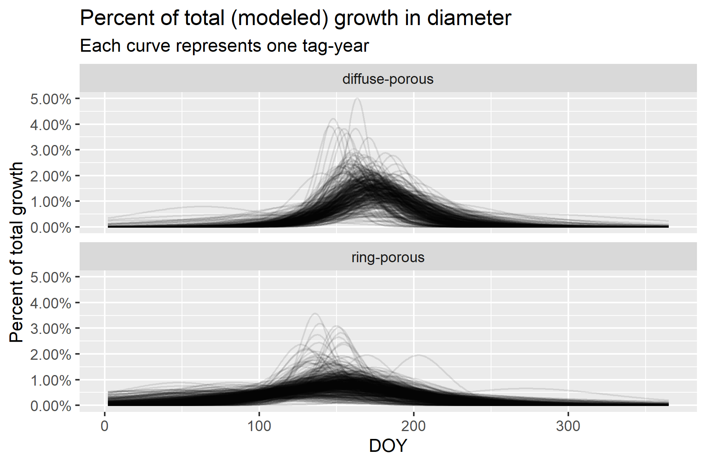
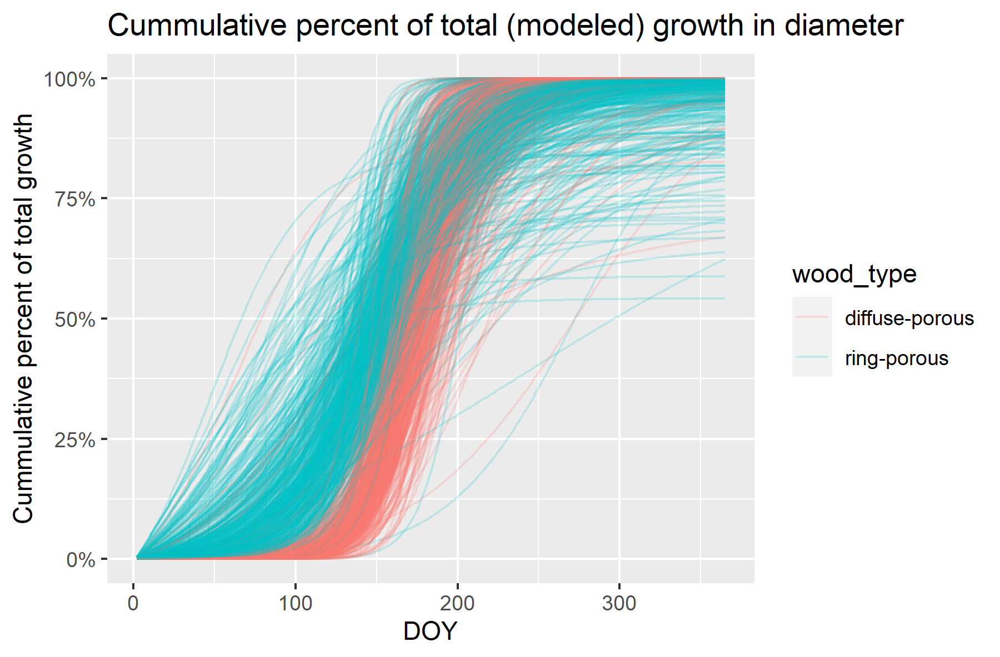
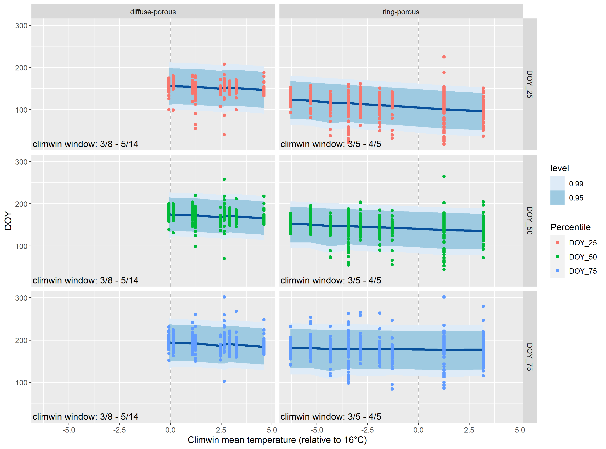

```{r setup, include=FALSE}
knitr::opts_chunk$set(echo = TRUE)
```


\raggedright

**Title:** Effect of spring temperatures on tree growth phenology in a temperate deciduous forest

**Authors (not yet complete, just alphabetical for now--final order TBD):** 

Cameron Dow^1^
Loïc D’Orangeville
Erika B. Gonzalez-Akre^1^,
Ryan Helcoski^1^,
Valentine Herrmann^1^,
Ian McGregor^1^,
Sean McMahon,
Albert Kim^1^,
David A. Orwig
Kristina J. Anderson-Teixeira^1,n^*


**Author Affiliations:**

1. Conservation Ecology Center; Smithsonian Conservation Biology Institute; Front Royal, VA 22630, USA

n. Center for Tropical Forest Science-Forest Global Earth Observatory; Smithsonian Tropical Research Institute; Panama, Republic of Panama


*corresponding author: teixeirak@si.edu; +1 540 635 6546


```{r eval=FALSE, echo=FALSE}
## This is a chunk that won't be evaluated or displayed. I use these for notes.
## Target journal: ??? Global Change Biology????
## Instructions for authors: 
#[insert guidance on word count, n figures/ tables allowed, and then some rough planning of what goes in this manuscript]

```

```{r eval = TRUE, echo=FALSE, warning=FALSE, results='hide'}
#Figures & Tables: listing figures and their number here is helpful for planning, and also allows automatic numbering within text -->easy changing of order. 

#Table numbers

#Figure numbers
schematic=1 #Based on D'Orangeville Figure 1
growth_pheno_by_xylem = 2
rel_growth = "2a" #Based on D'Orangeville Figure 3.a), but with relative growth
cum_growth = "2b" #Similar to D'Orangeville Figure 4.a), but with cumulative relative growth
# 3 climwin

pheno_Tsensitivity = 4

#captions

schematic_caption <- "Figure 1. Schematic illustrating the parameters considered here. Shown are measurements for an example tree (## cm SPECIES), fit with the model of McMahon & Parker (2015), from which phenology and growth rate parameters are obtained. ... (HERE, WE NEED TO ANNOTATE WITH LABELS FOR EACH PARAMETER CONSIDERED IN THE MANUSCRIPT. I'D ALSO DROP THE BACKGROUND SHADING--MAKES IT BUSY.)"

rel_growth_caption <- "Figure 2a. (SHOULD BE MERGED INTO SINGLE IMAGE WITH 2B. SEE BELOW FOR CAPTION)"

cum_growth_caption  <- "Figure 2. Growth trajectories for ring- and diffuse-porous trees, as both relative (a) and cumulative (b) fractions of total annual growth. Each line represents one year's growth for a given tree, fit with McMahon model."

pheno_Tsensitivity_caption <- "Figure 4. Relationship between DOY and climwin mean tempeatures. For each 
observed climwin mean temperature value, the posterior mean of the fitted day of year
is represented by the solid blue line and credible intervals are represented by bands."

```

\newpage

### Abstract


**Keywords**:  

\newpage


### Introduction

As global atmospheric greenhouse gas levels are rising, and little meaningful policy is being implemented in response, our planet is expected to surpass the 2.5 degree C warming mark that the Paris accord pledged to avoid. The absence of human intervention increases our reliance on natural systems to soften the blow of climate change. Plant life, especially forests, make up a large portion of these natural systems, offering many valuable ecosystem services. For one, they house an astonishing 80% of terrestrial species and are capable of removing the greenhouse gas CO2 from the atmosphere and storing it in the trees or soil. Forests sequester about one-third of all anthropogenic CO2 and store ~45% of all terrestrial carbon (Bonan, 2008). However, their future under the current era of rapid change is uncertain (Friedlingstein et al, 2006). 

Reducing this uncertainty requires better understanding of the drivers of tree growth (Bugmann et al, 2019). Tree growth is sensitive to climatic factors like precipitation, temperature, and cloudiness in early growing season (Helcoski et al, 2019; Ciais, 2003; Goulden, 1996), as well as other physical factors including nitrogen content of soil, increasing atmospheric CO2, deposition of atmospheric pollutants in acid rain (Mathias & Thomas, 2018), and invasion by pests or pathogens. Understanding how growth is influenced by these factors is essential for developing accurate models to inform forest managers and policy makers about the role of future forests in climate change mitigation efforts.

In recent decades, an increase in average Spring temperature has been impacting many natural systems including forests (Parmesan & Yohe, 2003; Zhihong, 2006). The effects of this Spring warming are most apparent when examining leaf phenology shifts, which have been extensively studied (Way, 2011; Klosterman & Hufkins & Richardson, 2018), leading to many critical observations. As temperatures are increasing, some regions have seen earlier leaf out in deciduous trees, sometimes matched or exceeded by later leaf senescence, meaning a potential shift in growing season timing or length (Ibáñez et al, 2010; Jeong et al., 2011). The timing of this Spring warming also has a significant effect on leaf phenology response. Warming events later in Spring were shown to impact leaf emergence timing more than earlier Spring warming (Freidl et al, 2014) and earlier leaf emergence has been shown to cause complex lagged effects on subsequent seasonal growth in European broad leaf deciduous and mixed forests (Crabbe et al, 2016). Another study found that the velocity of leaf development is correlated to bud burst timing, such that the later in the Spring bud burst occurred, the faster leaves developed and vice versa (Klosterman & Hufkins & Richardson, 2018). Therefore, timing of seasonal warming could influence when bud burst occurs, and consequently, lead to variations in total CO2 sequestered by deciduous forests. 

Shifts in leaf phenology timing could be accompanied by a change in stem-growth phenology, which would likely affect woody productivity, carbon and nutrient cycling, and water use patterns in temperate forests (Keeling et al, 1996;). However, the fine-scale responses of temperate deciduous tree growth to a warming Spring are not commonly recorded due to the increased effort required (). Many observations of climate induced phenological shifts are based on GIS (), eddy-covarience measurements (), or other broad scale measurements of phenological timing, and do little to discern differences between individual species, where leaf and stem-growth phenology can be decoupled (D'Orangeville et al, in review). Further to this point, a recent publication by D'Orangeville et al () found that leaf and wood phenology traits are dissimilar among trees of different wood types (ring-porous and diffuse-porous). For example, they observed that bud burst was occuring around the same time as 25% total annual growth, and 75% leaf development coincided with 50% total annual growth in ring-porous trees, while leaf phenology and stem growth phenology were decoupled in diffuse-porous trees. 
  
The significance of wood type in regards to wood and leaf phenology likely stems from evolutionary differences and adaptations to local climates where these trees can be found. Ring-porous trees have large xylem cells which are prone to embolism during the winter. These cells are repaired before leaf development, explaining why the 25% yearly growth milestone is reached around the same time as bud burst. Diffuse-porous xylem cells are smaller, and less prone to embolism during the Winter, meaning they do not need to be repaired in order to restore hydraulic functionality before beginning the leaf development process. Results from the paper by D’Orangeville et al. (in review) have shown that ring-porous trees reach 25 and 50% of their total yearly growth during Spring, while diffuse-porous trees reach these milestones in the Summer, but both reached 75% total annual growth around the same time. --Consequently, the Summer focused diffuse-porous trees are exposed to higher temperatures and drought risk than ring-porous trees.-- If leaf development is sped up when Spring temperatures are warmer, we should seek to understand whether this relationship holds, and how it potentially varies among trees of different wood-types. 

Earlier leaf up timings could signal that these trees are shifting their peak growth windows back in response to increasing Spring temperatures, but to date, very little research, has been done on the phenology of stem-growth. In fact, we know little about the stem-growth phenology of temperate deciduous species — let alone how these are affected by changes in Spring temperature patterns. Timing of intraannual stem-growth is extremely important as it could have profound impacts on ecosystem interactions, as well as dictate periods of highest drought sensitivity in temperate forests (Foster, 2014; ). If a drought were to occur when trees were at their peak growth rates, the resulting decrease in that year's NPP would reduce the total amount of carbon sequestered, contributing to a climate feedback loop (source?). 

While not entirely impossible, it is difficult to record intraannual growth or compare interspecific responses to Spring warming using leaf-phenology or other indirect observations. However, traditional methods of direct observation are labor intensive, and very time consuming (Source about cell sampling). A solution to this is the use of dendrometer bands. Dendrometer bands allow a look at individual trees’ intraannual growth at a fine temporal scale (source?). Using many measurements taken within a year, we can model the growth of individual trees and extract growth milestones and variables for interspecific, intraspecific, and temporal comparison (McMahon & Parker, 2014). This allows the determination of variable responses of all tree species within a single forest, meaning a better understanding of future growth under projected climate conditions. Here, we use 9 years of biweekly dendrometer band measurements for 4 species to characterize intraannual stem-growth phenology within a forest dynamics plot in the Eastern USA, calculating for each tree in each year where data was available: the day of year (DOY) where 25, 50, and 75% annual growth was achieved; the maximum growth rate; the DOY where maximum growth rate was achieved; and the total growth. Correlation between these variables and Spring temperatures over the 9 year study period (2011-2019) were assessed using a linear mixed model in a heriarchal bayesian framework.

We hypothesized that (1) stem-growth milestones would be reached earlier in warmer years as compared to cooler years and (2) both wood types would increase total growth and max growth rate in response to warmer Spring temperatures.


### Materials and Methods

*Study sites and data*

Study sites included **2/3** temperate forests in the Eastern United states, **both/all** part of the Forest Global Earth Observatory [ForestGEO; Anderson-Teixeira et al. 2015] (**Table 1?**). **Both/all** sites are dominated by broadleaf deciduous trees. *(insert site descriptions, including lat/long, elevation, plot size, climate info, dominant species. If we include SERC and if space permits, we may put this in a table, otherwise just text)*

Our first study site was the forest dynamics plot located at the Smithsonian COnservation Biology Institute 5 KM South of Front Royal, Virginia within the Blue Ridge Mountains (38 °53036.6″ N, 78°08043.4″W; elevation 273–338 m). The forest here was established in the mid-19th century after conversion from agricultural fields. Dominate canopy species within the 25.6 HA forest plot include tulip poplar (Liriodendron tulipifera), hickories (Carya spp.), and oaks (Quercus spp.). The climate is humid temperate, with a mean annual precipitation of 998 mm, January temperatures averaging 1 degrees C and July temperatures averaging 24 degrees C (Helcoski et al, 2019).  

The second study site was Harvard Forest in the central Massachusetts town of Petersham (42°53′ N, 72°17′ W, elevation?). Harvard forest was established in 1907 as a study site for university students and researchers. (Previous use?) Dominate species within the approximately 13 HA plot are hemlock (Tsuga spp.), oak (Quercus spp.) and maple (Acer spp.). The climate is temperate continental with a mean annual precipitation of 1120 mm, January temperatures averaging -12 degrees C and July temperatures averaging 19 degrees C (D'Orangeville et al, ).

The third study site was the forest dynamics plot located at the Smithsonian Ecological Research Center in Edgewater, Maryland near a sub estuary of the Chesapeake Bay (38°88′ N, 76°55′ W, elevation?). The forest here established roughly 120 years ago, while the plot was established in 2007. The 16 HA plot is dominated by tulip poplar (Liriodendron tulipifera), oak (Quercus spp.), beech (Fagus spp.), hickory (Carya spp.), and maple (Acer spp.). (Climate summary) 


Within the plot, metal dendrometer bands were installed on *>#* trees and measured with a digital caliper approximately every 1-2 weeks within the growing season for *9* years (*list ranges, for each site if different*). *(don't bother to mention biannual bands, unless you end up using the data--which you could, for annual growth, if you'd like to increase the sample size. You can put exact numbers of bands per year in an SI file.*)  The number of bands measured at each site fluctuated somewhat as trees were added or dropped (e.g., because of tree mortality) from the census *(Table S1)*. Across years, the number of bands sampled averaged *~150* at SCBI, # at Harvard Forest*, and # at SERC*. Four main species were sampled including two diffuse-porous (Lirodendron tulipfera and Fagus grandafolia) and two ring-porous (Quercus rubra and Quercus alba) species.    *(summary of how bands were distributed across species, focusing on ring/ diffuse porous distinction. details in an SI table)*

(Bands After cleaning: 2011- 105 trees; 2012 - 102 trees; 2013 - 102 trees; 2014 - 149 trees; 2015 - 149 trees; 2016 - 149 trees; 2017 - 148 trees; 2018 - 146 trees; 2019 - 145 trees *--put this in Table S1*). 

(Bands used after minimum growth checks: 
1  2011    84
2  2012    84
3  2013   100
4  2014   100
5  2015    96
6  2016    94
7  2017    89
8  2018    88
9  2019    75) this seems like alot are being thrown out - manually check if WAI
Measurements were timed to begin before beginning of spring growth and to continue through the cessation of growth in the fall. *(Give specifics, which may vary by site. Note that we adjusted timing at SCBI when we observed early leaf-out of understory shrubs/herbs)* The median start date was 4/14, which was adjusted when early leaf-out of understory shrubs and herbs was observed, and the median end date was 10/17, coinciding with late senesence in the plot. The earliest start date for intraannual measurements was in 2020 on March 30, and the latest end date was on 2012 on November 26. 

The dendroband data were manually cleaned by visual inspection. Three classes of mistakes: 1. Error in measurement - weekly measurement was drastically different from previous week and following week. Mistakes were removed from the raw data before modeling. (## cases) 2. Band slip or stuck - measurements freeze and remain unchanged until sudden jump followed by normal growth pattern. Band slips were sometimes followed by measurements indicating the band became stuck; in these cases, the tree was thrown out for the corresponding year. In cases where the slip was followed by normal growth, the initial slip-point was removed, and the following points were shifted down to the pre-slip level. (## cases) 3. Other - cases where data was clearly wrong but with unknown causes. This seemed to happen mostly in 2011, when the program was just beginning. In cases where several measurements were an issue, they were simply removed. If there were no clear solutions to ‘fix’ the data, the entire year was removed from the analysis.

Daily maximum temperatures (TMAX) were obtained from a meteorological tower adjacent to the SCBI ForestGEO plot (data can be found on the ForestGEO climate portal, DOI on github). The R package climpact was used to plot TMAX for visual inspection (# points removed?). Climpact also identifies readings that were greater than 3 standard deviations away from yearly means. These points were labeled as outliers and removed from the dataset. Gaps in the SCBI meteorological tower data were subsequently filled using TMAX readings obtained from a National Center for Environmental Information (NCEI) weather station located in Front Royal, Virginia (https://www.ncdc.noaa.gov/cdo-web/datasets/GHCND/stations/GHCND:USC00443229/detail). 

leaf phenology data?

•	leaf phenology data from NEON and/or satellite-based (leaf phenology network: https://www.usanpn.org/news/spring) ?

•	NDVI or PRI? https://onlinelibrary.wiley.com/doi/10.1111/gcb.15112 (from Ian)

•	From Ian: I noticed how the growth patterns observed by remote sensing pretty much mirror what Sean was finding with his dendro R package (btw is that functional on CRAN yet?) for both SERC and SCBI dendroband data.

perhaps bring in cores?

•	Sean’s model

•	Climwin

The period where the phenology milestone(s) were most affected by changes in early Spring temperature was determined using the R package Climwin. This package tests the correlation between climate variables (TMAX) and biological variables (DOY, max rate DOY, total growth) within a specified time-frame, reporting correlation and delta AIC's of each 'window'. as the best-model. We instructed Climwin to search for the best window beginning at February 1st and ending at the mean DOY for each phenology variable (chart in SI?). This was done to find corresponding (median of 95% CI window open and close) start and end dates for the analysis of ring-porous and diffuse-porous trees, as well as all trees pooled together.

*Analysis*

We fit the model of @mcmahon_general_2015 to define *phenological dates and growth rates* (Fig. `r schematic`). 


```{r schematic, out.width="100%", echo=FALSE, fig.align="center", fig.cap= schematic_caption}
# Created in RScripts/additional_figures.R
knitr::include_graphics("tables_figures/schematic.png")
```


Notes for now:

1. Model was fit to a random sample of 20 out of 106 tags to speed up computation. *(This isn't the case anymore, I fit it to all tag years)*
1. Climwin mean temperatures are recentered at 65F to help sanity check intercepts and slopes. 65F was chosen because it is a "typical" climwinmean value *(Changed to 16 C based on updated climwin windows)*
1. The multivariate model for $(DOY_{25}, DOY_{50}, DOY_{75})$ has:
    1. Fixed effects: The interaction between wood type (diffuse vs ring porous) and climwin mean
    1. Random effects: tag number (no species just yet)

-Mixed effect model

A mixed effect model was used to test the response of wood phenology variables (25% DOY, 50% DOY, 75% DOY, max-rate, max-rate DOY, total growth) to fixed effects of wood-type and Spring temperature, along with random effects of species and tag. We ran two separate models of each wood phenology variable for each of our major wood-types, and one combined model to use for comparison. Models were run using the LME4 package in R (Bates, D., Mächler, M., Bolker, B. & Walker, S. (2015). Fitting linear mixed‐effects models using lme4. J. Stat. Softw., 67, 1–48.)

•	Bayesian heirarchal model
This mixed-effect model was run within a heirarchal bayesian framework. 

### Results

•	variable averages 

Pooled across all species and all years the average DOY where max growth rate was achieved is DOY: 158, the DOY where 25% was achieved is DOY: 129, 50% - DOY: 157, 75% - DOY:184. 

*Phenological patterns*

Across all trees, Pooled across all species and all years the average DOY where max growth rate was achieved is DOY: 158, the DOY where 25% was achieved is DOY: 129, 50% - DOY: 157, 75% - DOY:184. 

Growth pheonology differed between ring- and diffuse- porous species, with ring-porous species having an earlier start to growth, with growth spread out over a longer growing season (Fig. `r growth_pheno_by_xylem`).
Specifically, 

Ring-porous (1395 obs) max growth rate – DOY: 147, max growth rate = .048 (find units in Sean’s function), 25% - DOY: 113, 50% DOY: 147, 75% - DOY: 181…68 days

Diffuse-porous (993 obs) max growth rate – DOY: 172, max growth rate = .068 (find units in Sean’s function), 25% - DOY: 153, 50% - DOY: 171, 75% - DOY: 190… 37 days

\newpage

```{r rel_growth, out.width="100%", echo=FALSE, fig.align="center", fig.cap= rel_growth_caption}
# Created in RScripts/additional_figures.R

```

```{r cum_growth, out.width="100%", echo=FALSE, fig.align="center", fig.cap= cum_growth_caption}
# Created in RScripts/additional_figures.R

```

*Climate windows*

•	Climwin results

*Climate sensitivity of phenology*

Warmer spring temperatures resulted in an earlier start of growth for ring-porous species and an earlier growing season for diffuse-porous species (Fig. `r pheno_Tsensitivity`).

```{r pheno_Tsensitivity, out.width="100%", echo=FALSE, fig.align="center", fig.cap=pheno_Tsensitivity_caption}
# Created in RScripts/bert/wood_phenology_analysis_bert.R

```


### Discussion

We have shown that intraannual growth patterns in North American temperate trees change in response to increasing Spring temperatures. The magnitude of these changes depends largely on the evolutionary differences inherent in the two wood types analyzed here. Ring-porous trees must repair winter embolism of their large xylem vessels before leaf expansion, achieving roughly 25% total yearly growth simultaneously with bud burst, and 50% yearly growth around the time of 75% leaf emergence (D'Orangeville et al,). On the other hand, diffuse-porous trees are less prone to cavitation and so do not need to repair winter embolism before bud burst, allowing up to 75% leaf out before reaching their 25% yearly growth totals (D'Orangeville et al). These differences are likely evolutionary hydraulic adaptations to climate (Baas & Wheeler, 2011). The presence of wide-xylem cells in ring-porous trees allows for greater water conductivity in the Spring at the cost of increased cavitation risk during Spring drought, and high likeliehood of damage during frost events (Cochard & Tyree, 1990; Sperry et al, 1994). The pre-leaf stem growth occurring in these species is fueled by non-structural carbon stores, often used for other cell maintenance activities within the plant (Sperry et al, 1994; Palacio et al, 2014; Sevanto et al, 2014). The dependence on these carbon stores for cambial activation could prove to be detrimental to long-term health of the tree, as exhaustion of reserves leads to carbon starvation (Sevanto et al, 2014). Diffuse-porous trees have narrower xylem cells lowering the risk of cavitation, but leading to a decreased water conductivity in the Spring, revealing a growth strategy more focused on a relatively faster, shorter growing season in the Summer (Sperry et al, 1994). This allows the diffuse-porous trees to conserve their carbon stores, making them potentially more resistant to pest/pathogen invasions?, but exposing them to higher temperatures and drought risk during their Summer-centered growth period. 

The mechanisms controlling activation of cambium reactivation is still debated, as some speculate Auxin, the chemical believed to kick-start the reactivation process, originates in the leaves (Frankenstein et al, 2005). However, the fact that ring-porous species complete 25% growth before the presence of leaf buds indicates there may be another source of Auxin production. *READ MORE ABOUT THIS!* The relationship between earlier cambial reactivation and early Spring temperature signals that the mechanism is influenced by temperature? 

Under the warming regime analyzed here, ring-porous trees reach 25% and 50% growth milestones earlier (insert actual # days?) in the year, while timing of 75% growth !!! Changed by constant amount !!! . This implies that the growing season of ring-porous trees expanded due to Spring temperatures, which are projected to continue to increase as anthropogenic global warming intensifies. In fact, we found a positive correlation between ring-porous growing season length and Spring temperature, while no such relationship was observed in diffuse-porous trees. The earlier reactivation of cambial cells is potentially exposing these trees to higher risk of cavitation or damage during frost events (Cochard & Tyree, 1990). Damage of this nature would then need to be repaired using carbon reserves, which may be in short demand as they are already being used for initial growth.This would negatively impact the plant's ability to maintain cell health, or reduce the ability to respond to invasion of pests or pathogens. Alternatively, the extension of growth season and higher yearly growth totals like we see here, could give ring-porous trees a competitive advantage over their non-responsive diffuse-porous counterparts.

Diffuse-porous growth timing seems relatively unaffected by early Spring temperatures, instead showing a higher correlation with late Spring or Summer temps. This disconnect means that diffuse-porous trees will continue to focus their growing season in the Summer, which is projected to become less conducive to tree growth as temperatures and drought intensity increase in some areas. ---- Studies have found that diffuse-porous trees in the Eastern USA show a larger reduction in ring-width increment during, and following Summer droughts when compared to species of other wood types (Orwig & Abrams, 1997; Kannenberg et al, 2018) as well as greater sensitivity to Summer precipitation patterns (Elliot et al, 2015). The potential for more frequent reduction in growth coupled with the increased growing season length of ring-porous species may lead to an alteration in forest species composition as diffuse-porous species are outcompeted.  

--the range of some of these species may migrate North to cooler summer conditions becoming potentially extant in the Southern / mid Atlantic of the USA.--    (Is mortality of ring-porous species higher in recent decades? Hard to pinpoint, but would likely be caused by warmer early-spring followed by late frost events exhausting NSC reserves?)

This analysis is one of a first generation of intraannual dendroband tree growth studies, and as such, is only the tip of the ice berg. Here, we focused our analysis purely on early Spring warming. This falls short of the reality of our changing climate, where each season is being affected in some way, leading to a combination of stressors on plant growth. For example, diffuse porous trees seemed to show little, if any, relationship with the climate window defined here, but if we shift that window forward 20 days, the effect increases dramatically, signalling a greater importance of May/June TMAX on trees of that wood type (figure or table?). This revelation agrees with the results from other climate sensitivity studies like Helcoski et al (2019), which found differences in interspecific growth responses to several climate variables throughout the year. Additionally, Other studies have found that Autumn leaf senescence is being delayed in response to warmer temperatures in the previous year's Winter or Autumn (), positive correlation between growth and higher winter temperatures (Heide, 1993; Delpierre et al, 2009), stunted total productivity induced by drought and high TMAX in the current year's Summer (), and an increase in diffuse-porous tree growth during the gorwing season following an abnormally cold winter (Benito & Pederson, 2015; Elliot et al, 2015). How these relationships may impact intraannual growth patterns is uncertain, but identifying such relationships will help us further understand how climate change is impacting forests. 

We present a stepping stone for future studies to build upon. 


Content to incorporate: N. American strategies have conservative strategies when it comes to phenology, as historically they’ve been subject to more spring frosts. Thus, climate change is having less impact (Zohner et al., 2020); Leaf velocity discussion? - - RP trees BB = 25% and 75% leaf development = 50% growth (D'Orangeville). Are DP trees leafing up earlier? If yes, how much earlier? Similar to 25,50,75% DOY retreat? 

### Acknowledgements
ForestGEO

### Authors' contributions


### References

