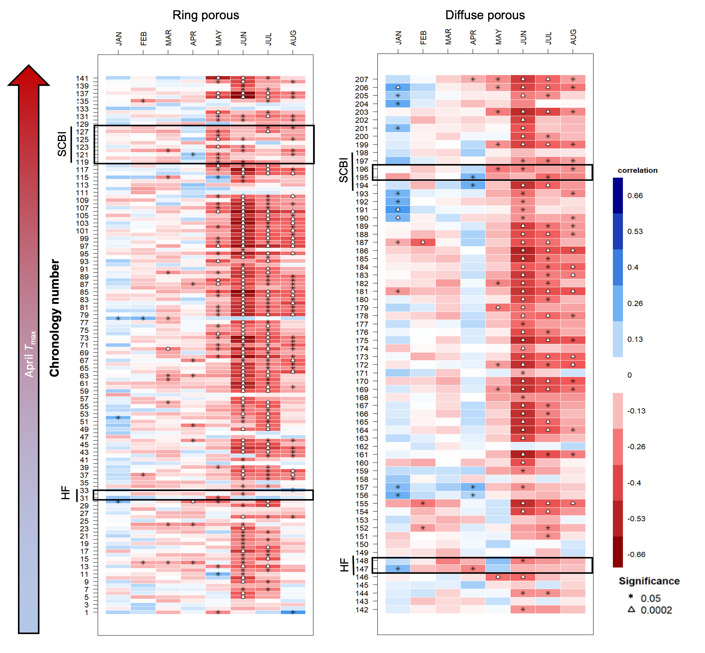

```{r setup, include=FALSE}
knitr::opts_chunk$set(echo = TRUE)
```


\raggedright

**Title:** Warmer spring temperatures in temperate deciduous forests cause earlier tree growth but have little effect on annual woody productivity

**Authors (not yet complete, just alphabetical for now--final order TBD):** 

Cameron Dow^1^

Albert Y. Kim^1,2^

Loïc D’Orangeville^3,4^

Erika B. Gonzalez-Akre^1^

Ryan Helcoski^1^

Valentine Herrmann^1^

*Grant Harley*

Justin Maxwell

Ian McGregor^1,5^

William McShea^1^

Sean McMahon^6,7^

David A. Orwig^3^

Neil Pederson^3^

Kristina J. Anderson-Teixeira^1,7^*


**Author Affiliations:**

1. Conservation Ecology Center; Smithsonian Conservation Biology Institute; Front Royal, VA 22630, USA

2. Statistical & Data Sciences; Smith College; Northampton, MA 01063, USA

3. Harvard Forest, Petersham, MA 01366, USA

4. Faculty of Forestry and Environmental Management, University of New Brunswick, Fredericton, NB, E3B 5A3, Canada.

5. NCSU

6. SERC

7. Forest Global Earth Observatory; Smithsonian Tropical Research Institute; Panama, Republic of Panama


*corresponding author: teixeirak@si.edu; +1 540 635 6546


```{r eval = TRUE, echo=FALSE, warning=FALSE, results='hide'}
## potential reviewers: Zani

## Target journal: Nature

## Nature articles: 3-4 modest display items

#Display items: listing figures and their number here is helpful for planning, and also allows automatic numbering within text -->easy changing of order. 

#Figure numbers
schematic_summary=1 #illustrates parameters
pheno_Tsensitivity = 2 
DOYtiming = 3
  DOYtiming_SCBI = "3a"
  DOYtiming_Harvard = "3b"
tree_rings = 4  

#figure captions

schematic_summary_caption <- "Figure 1 | Summary of tree growth changes under warmer spring temperatures. (a) Schematic illustrating parameters of interest and summarizing how each responds to warmer maximum temperatures during a 'critical temperature window', defined as that with the strongest control over $DOY_{25}$; (b) Variable definitions and summary responses to warmer spring temperatures at two temperate forests and for two groups of broadleaf deciduous species (RP=ring porous; DP=diffuse porous), where up and down arrows indicate increases and decreases, respectively, 'n.s.' indicates no signficant correlation, and 'mixed' indicates a mix of signficant and non-signficant correlations, often in different directions."

pheno_Tsensitivity_caption <- "Figure 2 | Relationship between growth parameters and climwin mean temperatures. For each 
observed climwin mean temperature value, the posterior mean of the fitted day of year
is represented by the solid blue line and 95% credible intervals are represented by bands. (**SHOULD WE SHOW ONLY THE DOY TRENDS and Lpgs (top 2 rows), GIVEN LACK OF SIGNIFICANT TRENDS IN THE OTHERS AND BECAUSE WE NEED TO KEEP FIGURES COMPACT?**)"

DOYtiming_caption <- "Figure 3 | Leaf (a,b) and stem growth (c,d) phenology at the Smithsonian Conservation Biology Institute (a,c) and Harvard Forest (b,d) from 1998 to 2020 (when available). Panels (a-b) show leaf phenology... Panels (c-d) show the dates at which stem growth milestones were acheived, on average, for sampled populations of ring-porous and diffuse-porous trees at each site. Mean temperature was calculated for each wood-type/site combination over the respective critical $T_{max}$ window, then turned into a ratio and assigned a color on a gradient where the coldest year in the sample is blue and the warmest is red. (**SHOULD WE COMBINE LEAF AND STEM PHENOLOGY ON A SINGLE PLOT WITH SEPARATE Y-AXES?** See [GitHub Issue #50](https://github.com/EcoClimLab/growth_phenology/issues/50). )"

tree_rings_caption <- "Figure 4 | Sensitivity of annual growth, as derived from tree-rings, to monthly maximum temperatures, for ## chronologies from ## sites across eastern North America. Chronologies are grouped by xylem porosity and ordered by mean April T_max. Chronology details are given in Table S4. (NOTE: Figure still needs some work. **COLOR SCALE IS  A BIT OFF.**  See [GitHub Issue #49](https://github.com/EcoClimLab/growth_phenology/issues/49).)"

# SUPPLEMENTARY INFO (this chunk must be repeated in Dow_SI.Rmd)
##SI table numbers
table_species="S1"  
sample_size_by_species= "S2"
sample_size_by_year= "S2"
mean_growth_parameters_table="S3" 
chronologies_table="S4" #!!! Hand-numbered in tree-ring figure captions

#SI figure numbers
growth_curves_all = "S1"  
climwin = "S2"
tree_rings_TMIN = "S3"

###~~~~~~~~~~~~~~~~~~~~~~~~~~~~~~~~~~~~~~~~~~~~~~~~~
## some stats/ 
species_table <- read.csv(file = "tables_figures/species_table.csv")
n_dendro_trees <- sum(na.omit(species_table[, "n.trees"]))
n_tree_years <- sum(na.omit(species_table[, "n.tree.years"]))
n_cores_focal_sites <- sum(na.omit(species_table[, "n.cores"]))
n_chronologies <- NA
n_cores_sites <- NA
n_chronologies_SCBI <- NA
n_chronologies_HF <- NA
```


\newpage

# (Summary paragraph)
```{r eval=FALSE, echo=FALSE}
## For Nature:
# Articles start with a fully referenced summary paragraph, ideally of no more than 200 words, which is separate from the main text and avoids numbers, abbreviations, acronyms or measurements unless essential. It is aimed at readers outside the discipline. This summary paragraph should be structured as follows: 2-3 sentences of basic-level introduction to the field; a brief account of the background and rationale of the work; a statement of the main conclusions (introduced by the phrase 'Here we show' or its equivalent); and finally, 2-3 sentences putting the main findings into general context so it is clear how the results described in the paper have moved the field forwards. Please refer to our annotated example  to see how the summary paragraph should be constructed.

```

(*word limit 200. italic=tentative*)


As the climate changes, warmer spring temperatures are causing earlier leaf-out[@jeong_phenology_2011] and commencement of net carbon dioxide (CO~2~) sequestration[REFS] in temperate deciduous forests, resulting in a tendency towards increased growing season length[@menzel_growing_1999;@menzel_european_2006;@ibanez_forecasting_2010;@jeong_phenology_2011] and annual CO~2~ sequestration[@keeling_increased_1996;@dragoni_evidence_2011;@crabbe_extreme_2016].
However, little is known about how spring temperatures affect tree stem growth, which consumes only a modest portion of the carbon fixed annually[@anderson-teixeira_carbon_2021] but sequesters that carbon in wood, which has a long residence time in the ecosystem [@xue_global_2017;@russell_residence_2014] or as wood products[@profft_forest_2009].
Here, we show that in two temperate deciduous forests, warmer maximum spring temperatures consistently shifted woody growth milestones earlier but had mixed, weak effects on peak growing season length, maximum daily growth rates, and annual growth.
The latter finding is confirmed on the centennial scale by `r n_chronologies` tree-ring chronologies from `r n_cores_sites` forests across eastern North America, which show that annual growth is by far more sensitive to temperatures during the peak growing season than in the spring.
These findings align with eddy-covariance records showing that annual CO~2~ sequestration is more strongly linked to conditions in the peak growing season than to growing season length[@fu_maximum_2019], with *previous* observations that warm springs result in earlier leaf senescence[@zohner_ongoing_2019; @zani_increased_2020], and with evidence that forest CO~2~ sequestration is sink-limited[@zani_increased_2020].
They contrast, however, with the expectation *in most models[@zani_increased_2020]* that an earlier start to growing season would significantly increase the rate of biomass accumulation and thereby enhance the CO~2~ sink of temperate deciduous forests.
Rather, our findings imply that *the extra CO~2~ sequestered in years with warmer springs[@keeling_increased_1996;@dragoni_evidence_2011;@crabbe_extreme_2016] must be allocated primarily to relatively short-lived C pools and therefore unlikely to have a lasting impact on the forest C balance.*
Thus, warming spring temperatures are unlikely to increase the woody productivity or strengthen the carbon sink of temperate deciduous forests.


\newpage


# (Introduction)

(*this first paragraph needs to be re-written (very concisely, and focused on the temperate forest C sink and its uncertainty*)

As Earth's atmospheric CO~2~ concentrations and temperatures increase, the responses and feedbacks of forests will play an important yet uncertain role in influencing atmospheric CO~2~ and climate change[@arora_carbon_2020; @friedlingstein_global_2020]. 
Temperate deciduous forests, including those in eastern North America, *(have been net carbon sinks over the past several decades)*... 
*[Discuss this sink, mechanisms, uncertainties, ending with the point that one meaningful uncertainty is how the C sink will respond to warming springs]*

**In recent decades, warming temperatures have resulted in widespread phenological changes indicative of earlier arrival of spring[@parmesan_globally_2003, @ibanez_forecasting_2010,@jeong_phenology_2011,@friedl_tale_2014] and *often later autumn*[@ibanez_forecasting_2010,@jeong_phenology_2011].**
In temperate deciduous forests, spring leaf-out has been occurring earlier[@ibanez_forecasting_2010, @jeong_phenology_2011], as has the beginning of the annual period of net CO~2~ sequestration[REFS].
Controls on the timing of autumn senescence are less clearly understood (*need to do more lit review on this*).
Experimental evidence demonstrates that warmer spring temperatures lead to earlier leaf-out and earlier leaf senescence[@zohner_ongoing_2019;@keenan_timing_2015], apparently because of sink-limitation to CO~2~ sequestration[@zani_increased_2020], whereas warmer summer and autumn temperatures delay leaf senescence[@zohner_ongoing_2019;@crabbe_extreme_2016;@dragoni_evidence_2011;@jeong_phenology_2011;@ibanez_forecasting_2010;@vitasse_responses_2009].
Whatever the mechanisms controlling autumn senescence, the observed pattern is that spring warming generally results in an increased growing season length, measured as the period over which trees have leaves[@jeong_phenology_2011] and the ecosystem is a net CO~2~ sink[REFS].

~~~~~~~~~~
##(content --with associated refs--that we don't want to lose, but that needs to be worked into reworded text above)

The effects of this spring warming are most apparent when examining leaf phenology shifts, *which have been extensively studied ([@way_tree_2011]; [@klosterman_later_2018]), leading to many critical observations*. 
For example, some regions have seen earlier leaf out in deciduous trees, which is often matched or exceeded by delays in leaf senescence timing, when springtime temperatures are above average [@ibanez_forecasting_2010;@jeong_phenology_2011;@crabbe_extreme_2016]. 
~~~~~~~~~~~~~~~~

**The expectation is that as growing season length increases, net annual carbon sequestered will increase as well (*i,e*, net ecosystem exchange, $NEE$)[@churkina_spatial_2005; @keenan_net_2014; @zhou_explaining_2016].** 
*This expectation is represented in models [@zani_increased_2020].*
However, recent evidence that leaf senescence is induced when the seasonal carbon-sink capacities of trees are reached suggests that warmer spring temperatures and earlier leaf-out could advance autumn senescence and *will not necessarily lead to drastically increased C sequestration*[@zani_increased_2020]. 

**We know very little about how the longest-lived component of fixed carbon, the woody growth of trees, is responding to warming spring temperatures.** 
In fact, we know little about the stem-growth phenology of temperate deciduous species, with multi-year records of growth phenology having been published for only one site [D'Orangeville]. *(We need to make sure we're not missing anything.)* 
Tree-ring records, which can be used to examine correlations of annual growth to monthly temperatures but not to understand growth phenology, reveal that growth of temperate deciduous trees tends to be most sensitive to summer temperatures (REFS), with some hints that warmer springs may have a modest positive effect on growth (e.g., Refs.[@helcoski_growing_2019] [MORE]).
Thus, tree-ring records do not necessarily corroborate findings that warming spring temperatures lengthen the growing season and increase annual CO~2~ sequestration. 
Characterizing phenological responses of stem growth to warming spring temperatures is critical to bridging this conceptual disconnect and understanding how forest biomass growth is likely to change as the climate warms.

**Here, we characterize how early spring temperatures affect stem growth phenology, growth rates, and annual growth of temperate deciduous trees in two forests (Fig. `r schematic_summary`) and annual growth across these and an additional `r n_cores_sites-2` forests spanning eastern North America.** 
First, using dendrometer band measurements taken throughout the growing season at the Smithsonian Conservation Biology Institute (SCBI; Virginia; n = **146** trees over 10 years) and Harvard Forest (Massachusetts; n = **755** trees over six years), we fit a growth model[@mcmahon_general_2015] to determine the days of year where 25, 50, and 75% annual growth was achieved ($DOY_{25}$, $DOY_{50}$, $DOY_{75}$), peak growing season length ($L_{pgs}= DOY_{75}$-$DOY_{25}$), maximum growth rates ($g_{max}$) and the DOY on which they occurred ($DOY_{g_{max}}$), and total annual growth ($\Delta DBH$; Fig. `r schematic_summary`). 
This analysis was performed separately for ring- and diffuse-porous species, which differ in growth phenology[*D'Orangeville*], and set in the context of leaf phenology at these sites.


```{r schematic_summary, out.width="100%", echo=FALSE, fig.align="center", fig.cap= schematic_summary_caption}
# Created in RScripts/additional_figures.R
knitr::include_graphics("tables_figures/schematic_summary.png")
```


# (Results)

## (overview of phenological patterns)

*(we will need to add leaf phenology to this paragraph)*

**Growth milestones were achieved earlier at SCBI than at Harvard Forest (average difference: 6-10 days) and differed between ring- and diffuse-porous species (Fig. `r growth_curves_all`, Table `r mean_growth_parameters_table`).**
Across all trees and years, the mean $DOY_{25}$ occurred on day 139 (May 20) at SCBI and day 148 (May 29) at Harvard Forest, while $DOY_{75}$ occurred on day 185 (July 5) at SCBI and day 193 (July 13) at Harvard Forest.
Consistent with the results of Ref[D'Orangeville], ring-porous species began growing earlier, reaching the $DOY_{25}$ benchmark earlier (by `r 154-123` days at SCBI and `r 164-132` at Harvard Forest), and their growth was spread out over a longer growing season (average $L_{PGS}$ 21 and 19 days longer at SCBI and Harvard Forest, respectively). 
Growing season length was similar across sites, with $L_{PGS}$ being, on average, only two days longer at SCBI for ring-porous species and less than one day longer for diffuse-porous species. 

## (Critical temperature windows)

For the majority of weekly time windows from Jan. 1 to $DOY_{25}$, there was a negative or neutral relationship between $T_{max}$ and $DOY_{25}$, meaning that warmer temperatures shifted growth earlier in the season (Fig. `r climwin`). 
This held true for both ring- and diffuse-porous trees at both sites, *albiet* with less consistent patterns at Harvard Forest, which was sampled for fewer years. 
The strongest relationships, including but not limited to the optimal time windows (Table `r mean_growth_parameters_table`), occurred for time windows closing $\le$ 5 weeks prior to $DOY_{25}$. 


The correlation of $DOY_{25}$ to $T_{min}$ was less consistent than that of $T_{max}$ (**NEEDS SUPPORTING FIG**). 
At SCBI, patterns were quite similar to those described above for $T_{max}$, with similar timing and strengths of correlations across the two temperature variables (**NEEDS SUPPORTING FIG**).
In contrast, at Harvard Forest, where we had only six years of data, *climwin* selected windows greater than five weeks prior to $DOY_{25}$, had positive correlations between $DOY_{25}$ and $T_{min}$.
However, for both ring- and diffuse- porous species, average $T_{min}$ of the selected period was below freezing (<0°C) in all years, suggesting that these are sporadic correlations that are unlikely to be biologically meaningful.

Henceforth, we focus on $T_{max}$ assessed over *climwin*-selected critical temperature windows, *noting that similar results are obtained using alternate temperature window ([GitHub issue #42](https://github.com/EcoClimLab/growth_phenology/issues/42)).*

## (Climate sensitivity of phenology )

For both ring- and diffuse- porous species at both sites, warmer spring $T_{max}$ resulted in earlier achievement of growth milestones (Fig. `r schematic_summary`, Figs. `r pheno_Tsensitivity`).
Specifically, $DOY_{25}$, $DOY_{50}$, $DOY_{75}$, $DOY_{g.max}$, leaf greenup, and mid-greenup, at both sites all decreased significantly with increasing $T_{max}$ during the critical temperature window (Figs. `r schematic_summary`, `r pheno_Tsensitivity`, `r DOYtiming`).

```{r pheno_Tsensitivity, out.width="80%", echo=FALSE, fig.align="center", fig.cap=pheno_Tsensitivity_caption}
# Created in RScripts/bert/wood_phenology_analysis_bert.R
knitr::include_graphics("tables_figures/pheno_Tsensitivity_combo_patchwork_AIC.png")
```

```{r DOYtiming, out.width="100%", echo=FALSE, fig.align="center", fig.cap= DOYtiming_caption}
# Created in RScripts/additional_figures.R
knitr::include_graphics("tables_figures/DOYtiming_allyears.png")
```

For two of the four species group-site combinations (ring-porous at SCBI and diffuse-porous at Harvard Forest), warmer $T_{max}$ during the critical temperature window resulted in increased $L_{PGS}$ (Figs. `r schematic_summary`, `r pheno_Tsensitivity`).
*At SCBI, ring-porous $DOY_{25}$ and $DOY_{50}$ shifted earlier as a result of warmer springs whereas ${DOY_75}$ did not shift significantly, resulting in a positive correlation between $L_{PGS}$ and $T_{max}$ during the critical temperature.*
*For diffuse-porous species* At SCBI, all growth milestones occurred earlier in warmer springs, but $DOY_{25}$ was more strongly affected than ${DOY_75}$, resulting in increased $L_{PGS}$.
At Harvard Forest,  all growth milestones occurred earlier in warmer springs, but ring-porous ${DOY_75}$ shifted more than ${DOY_25}$, resulting in shorter peak growing season length. 

Ring- and diffuse- porous species were pooled together at each site for leaf phenology measures. Day of year of greenup occurred 21 days earlier at SCBI and 7 days earlier at Harvard Forest when comparing the year with the warmest and coldest critical windows in the analysis (Fig. 3). Mid-greenup timing also shifted forward at both sites when spring temperatures were higher but less so than greenup. Senescence occurred earlier at Harvard forest by 12 days in the warm year while SCBI saw a 5 day delay of senescence during the warm year.      

## (Climate sensitivity of growth)

Maximum growth rate, $g_{max}$, was not consistently linked to early spring temperatures (Figs. `r schematic_summary`, `r pheno_Tsensitivity`). 
Ring-porous species exhibited no change (SCBI) or a slight increase (Harvard Forest) with warmer $T_{max}$ during the critical temperature window.
In contrast, diffuse-porous species at both sites exhibited lower $g_{max}$ in years with higher early spring $T_{max}$.

Total annual growth was not consistently linked to spring temperatures (Fig. `r schematic_summary`).
Annual growth measured with dendrometer bands, $\Delta DBH$, also was not consistently linked to early spring temperatures, displaying either no relationship (SCBI) or extremely small changes in opposite directions for ring- and diffuse- porous species (Harvard Forest) (Fig. `r pheno_Tsensitivity`).

**To understand how annual growth, as registered in ring width indices ($RWI$), have responded to spring temperatures at the centennial scale, we analyzed tree-ring chronologies for `r n_chronologies_SCBI` species at SCBI, `r n_chronologies_HF` species at Harvard Forest.**
*(The following should be condensed:)*
Residual chronologies rarely exhibited significant correlations to either $T_{max}$ or $T_{min}$ in the months corresponding to the critical temperature windows identified here (Figs. `r tree_rings`, `r tree_rings_TMIN`).
Although correlations were rarely significant, there was a consistent pattern in responses to $T_{max}$ across all species at both sites:
responses to $T_{max}$ were negative or neutral in all months from February to August, with the exception of one spring month at each site (April at SCBI, May at Harvard Forest) where growth displayed a positive or neutral responses to $T_{max}$ (Fig. `r tree_rings`).
In these months, positive correlations to $T_{max}$ were statistically significant (at p=0.05) for one of nine ring-porous species at SCBI and one of two diffuse-porous species at each site.
In the prior months, the generally negative correlations to $T_{max}$ were not significant, excepting significant correlations of one species at each site  (ring-porous *Carya tomentosa* in March at SCBI; diffuse-porous *Acer rubrum* in April at Harvard Forest).
Starting in May at SCBI, significant correlations to $T_{max}$ were common, occurring for nine of the eleven species in May and 3-7 species for each month June through August.
At Harvard Forest, there was only one statistically significant negative correlation to post-May $T_{max}$ (*Quercus rubra* in June). 

```{r tree_rings, out.width="100%", echo=FALSE, fig.align="center", fig.cap= tree_rings_caption}

```

Patterns in $T_{min}$ were fairly similar to those of $T_{max}$, but weaker and more stochastic, with more (non-significant) correlations going in opposite directions (Fig. `r tree_rings_TMIN`). 
There were no significant correlations to $T_{min}$ prior to May at SCBI or June at Harvard Forest. 

**To set these findings in a broader scale context, we analyzed an additional `r n_chronologies-n_chronologies_SCBI-n_chronologies_HF` chronologies from `r n_cores_sites-2`.** 
In total, our analysis included # species at sites distributed from XXX to XXX and spanning a ## degree range in April T.** 
*(describe results across all sites)*
(Fig. `r tree_rings`)


# (Discussion)

(*length may be okay, shouldn't be lengthened*)

We found that warmer spring temperatures in temperate deciduous forests cause earlier tree growth but have little effect on annual woody productivity ( `r schematic_summary`- `r DOYtiming`). Using dendroband data, we found that the peak growing season generally advanced as the critical spring windows warmed (Fig. `r DOYtiming`). Despite this shift, growth variables $L_{pgs}$. $g_{max}$ and $\Delta DBH$ were virtually unchanged when this period warmed, but $DOY_{g_{max}}$ shifted back almost in unison with $DOY_{50}$ (Fig 2). The lack of influence Spring $T_{max}$ exudes on $\Delta DBH$ found with the dendroband data agrees with patterns observed in tree cores, which show that annual tree growth depends more on peak growing season conditions than early season advancement.   

Although the number of years analyzed here is limited (10 years at SCBI, 6 years at HF), the signal is clear and consistent: for both species groups at both sites, warmer temperatures during virtually any part of the spring led to significantly earlier achievement of growth milestones (Figs. `r schematic_summary`-`r DOYtiming`).
This indicates that the effect of $T_{max}$ on the timing of growth ($DOY_{25}$, $DOY_{50}$, $DOY_{75}$,and $DOY_{g_{max}}$) is not subtle. 
Indeed, growth milestones advanced by 1-8 days per degree Celsius during the critical temperature window.
This is consistent with previous studies showing that ... *(find/cite some statistics on how rapidly leaf phenology or start of C sequestration advance with T--- This could be tough. It looks like that varies alot by region and species.)*

In contrast to the pronounced effects of $T_{max}$ on the timing of growth, its effects on $g_{max}$ and $\Delta DBH$ were less consistent and generally quite subtle (Figs. `r schematic_summary`, `r pheno_Tsensitivity`), such that a much longer record would be needed to clarify what, if any, effect spring temperatures have on maximum daily and annual growth rates. 
Fortunately, we were able to use tree-ring data to understand centennial-scale temperature sensitivity of annual growth (Fig. `r tree_rings`).
This analysis confirms that the effect of spring temperatures on annual growth is modest and not statistically significant for most species, while revealing a slightly more complex picture.
It appears that temperatures--particularly $T_{max}$--during one spring month at each site (April at SCBI, May at Harvard Forest) consistently have a weakly positive (*albiet* rarely significant) effect on annual growth, in striking contrast to the predominantly negative correlations of growth rates with $T_{max}$ in preceding and subsequent months.
This suggests that spring $T_{max}$, though it's pronounced influence on the start of woody growth and subtle influence on length of the peak growing season, has a modestly positive influence on annual tree growth, but that this influence is generally of secondary importance to other factors. 

Indeed, the tree-ring records reveal that annual growth is most commonly controlled by climate conditions during the peak growing season [Fig. `r tree_rings`; @helcoski_growing_2019], .
(*1-2 sentences reviewing our regional analysis results /generalizing about climate sensitivity of temperate deciduous forest growth.*)
Thus, although our dendrometer band analysis is limited to two sites, the finding that spring temperatures have limited effect on annual tree growth holds generally.

Our findings contribute to a broader picture of the influence of spring temperatures on forest ecosystem function. 
Warm spring temperatures result in earlier leaf-out (Fig. `r DOYtiming` , REFS), an earlier start to net C sequestration (REFS), and, as shown here, earlier initiation of stem growth (Figs. `r schematic_summary`- `r DOYtiming`).
Yet, an earlier start to the growing season is not associated with a longer growing season (Figs. `r schematic_summary`, `r pheno_Tsensitivity`) [@zani_increased_2020]
because growth finishes sooner under these conditions, presumably because of *C sink limitation* [@zani_increased_2020].


As climate change accelerates and spring temperatures become increasingly warmer, growing seasons will start earlier, but this is unlikely to provide the increased carbon sequestration that is anticipated in most models (Figs. `r schematic_summary`, `r pheno_Tsensitivity`, `r tree_rings`)[@zani_increased_2020].
Because of this, temperate deciduous forests are likely to sequester less CO~2~ than most models suggest, implying that these models are underestimating future overall atmospheric CO~2~.


# (Content to incorporate) 


However, more of the interannual variation in forest $NEE$ is explained by variation in maximum C uptake rates than by the length of the carbon uptake period [@zhou_explaining_2016; @fu_maximum_2019]. This idea agrees with patterns seen in tree cores, where peak growing season climate was more influential than spring climate [@helcoski_growing_2019] but many models still predict the extension of growing season will increase NEE. 

@delgado_differences_2020 

From Neil: @zhang_drought_2021, @zhang_extended_2020

effect of spring temperature on annual growth in New England: @alexander_potential_2019

results align with @fu_maximum_2019, which shows that interannual variation in NEE is more strongly linked to peak C uptake rates than to growing season length. Our study demonstrates that this holds true for $ANPP_{woody}$ as well as NEE.

Geng et al. 2020 GCB- Climate warming increases spring phenological differences among temperate trees.

N. American strategies have conservative strategies when it comes to phenology, as historically they’ve been subject to more spring frosts. Thus, climate change is having less impact (Zohner et al., 2020); Leaf velocity discussion? - - RP trees BB = 25% and 75% leaf development = 50% growth (D'Orangeville). Are DP trees leafing up earlier? If yes, how much earlier? Similar to 25,50,75% DOY retreat? 

Another study found that the velocity of leaf development is correlated to bud burst timing, such that the later in the spring bud burst occurred, the faster leaves developed and vice versa (Klosterman & Hufkins & Richardson, 2018).  

The timing of tree growth has profound impacts on ecosystem interactions, as well as dictates periods of highest drought sensitivity in temperate forests (Foster, 2014; D’Orangeville et al. in review). Species have co-evolved to utilize the phenological stages of trees at specific times in the year. If the timing of intraannual phenology traits were to shift, that could harm the species depending on the trees (). Additionally, if a drought were to occur when trees were at their peak growth rates, the resulting decrease in that year's NPP would reduce the total amount of carbon sequestered, contributing to a climate feedback loop further exacerbating these potential shifts (source?). 


# Methods

## Study sites

Study sites included two temperate forests in the eastern United States, both part of the Forest Global Earth Observatory [ForestGEO; Anderson-Teixeira et al. 2015; Davies et al. 2021]. 

Our first study site was the forest dynamics plot located at the Smithsonian Conservation Biology Institute 5 km South of Front Royal, Virginia within the Blue Ridge Mountains (38.8935° N, 78.1454° W; elevation 273–338 m.a.s.l.). 
The forest here was established in the mid-19th century after conversion from agricultural fields. 
Dominate canopy species within the 25.6 ha forest plot include tulip poplar (*Liriodendron tulipifera*), oaks (*Quercus spp.*), hickories (*Carya spp.*). 
The climate is humid temperate, with a mean annual precipitation of 998 mm and temperatures averaging 1° C in January and 24° C in July ([helcoski_growing_2019]).  

The second study site was Harvard Forest (42.5388° N, 72.1755° W, 340-368 m.a.s.l.), located near the central Massachusetts town of Petersham.
Harvard forest is a secondary forest, having re-established following agricultural use *(time frame)* and signficant hurricane damage in *YEAR*. 
Dominate species within the 35 ha ForestGEO plot are hemlock (*Tsuga spp.*), oak (*Quercus spp.*) and maple (*Acer spp.*). 
The climate is temperate continental with a mean annual precipitation of 1120 mm and temperatures  averaging -12° C in January and 19° C in July (D'Orangeville et al, ).

## Data collection and preparation
### Dendrometer bands

Metal dendrometer bands installed on a total of `r n_dendro_trees` trees within the SCBI and Harvard Forest ForestGEO plots (Table `r table_species`). 
Bands were placed on dominant species, including two diffuse- and two ring-porous species at SCBI and eight diffuse- and three ring-porous species at Harvard Forest.
Bands were measured with a digital caliper approximately every 1-2 weeks within the growing season from 2011-2020 at SCBI and 1998-2003 at Harvard Forest, respectively. 
The number of bands measured at each site fluctuated somewhat as trees were added or dropped (e.g., because of tree mortality) from the census (Table `r sample_size_by_year`) *(tags_per_year_preclean in data folder)*. 
Across years, the number of bands sampled averaged *~135* (range: 99-145) at SCBI and  *~717* (range: *700-755*) at Harvard Forest. 
In total, our analysis included `r n_tree_years` tree-years (Table `r table_species`).


Measurements were timed to begin before the beginning of spring growth and to continue through the cessation of growth in the fall. 
At SCBI, the median start date was 4/14, which was adjusted when early leaf-out of understory shrubs and herbs was observed, with the earliest start date being March 30, 2020. Measurements were continued through to fall leaf senescence, with the median end date being 10/17 and the latest end date was November 26, 2012. 
Timing of measurements at Harvard Forest was similar, with the median start date of 4/23 and median end date of 10/30. 1998 was an anomalous year where initial measurements were taken on 1/5, but not taken again until 4/15. The latest end date was November 11, 2002.

The dendrometer band data were manually cleaned by visual inspection before analysis. 
We screened for three classes of mistakes. 
First, when a weekly measurement was drastically different from previous week and following weeks, this was assumed to be a measurement error and the record was removed.
Second, when measurements remained essentially unchanged for several readings, followed by a sudden jump followed by normal growth pattern, this was assumed to be a case where the band was stuck and then released. In these cases, the full annual record for the tree was removed.
Third, there were cases where data were clearly wrong but with unknown causes. In cases where several measurements were an issue, they were simply removed. If there were no clear solutions to ‘fix’ the data, the entire year was removed from the analysis.

We fit the model of @mcmahon_general_2015 to define phenological dates and growth rates (Fig. `r schematic_summary`). 
This five-parameter logistic model was fitted to dendrometer band data from each tree-year in R: 
$$ DBH = L + \frac{K - L} { 1 + 1/\theta \cdot exp[-r(DOY - DOY_{ip}) / \theta)] ^ \theta}$$ 
Here, $L$ and $K$ are lower and upper asymptotes of the model, corresponding to $DBH$ at the beginning and end of the year, respectively. 
$DOY$ are the modeled days of year (*i.e.*, julian days), 
$DOY_{ip}$ is the day of year where the inflection point in growth rate occurs,
$r$ *shapes the slope of the curve at the inflection point*,
and $\theta$ is a tuning parameter controlling the slope of the curve toward the upper asymptote. 
*We note that the DOY on which maximum growth occurs, $DOY_{g_{max}}$ (Fig. `r schematic_summary`) occurs on $DOY_{ip}$ only when $\theta = 1$.*
Using the optimized parameters for each tree-year, we then modeled $DBH$ throughout the year and extracted the intra-annual growth variables of interest (Fig. `r schematic_summary`). 

After fitting the @mcmahon_general_2015 model, we used a script to remove poorly fit models. 
Models were judged to be poorly fit if certain modeled growth characteristics fell outside of the acceptable range we determined. 
Modeled fits for tree-years were removed under five conditions:
(1) single day growth rates were higher than 2 standard deviations away from the mean for each wood-type (SCBI = 2, HF = 34); 
(2) $DOY_{ip}$ was $\ge 2$ standard deviations away from the mean for it's xylem architecture group, year, and site (SCBI = 62, HF = 106); 
(3) tree-years with small or negligible total growth ($\Delta DBH$ < 0.02 mm; SCBI = 0, HF = 66); 
(4) model fit predicted total yearly growth to take longer than 365 days, indicating poor model fit (SCBI = 181, HF = 199); 
and (5) models with unexplained sharp spikes in growth rate (SCBI = 0, HF = 3). 
At Harvard Forest the tag years removed through this method was proportional to the original sample size, indicating that no species or size class was disproportionately removed compared to others *(SI figure? data_cleaning_figure_hf in manuscript folder)*. 
At SCBI a higher proportion of RP trees were removed--the majority in step 4 *(data_cleaning_figure_scbi)*. 

### Tree-rings
Dominant tree species were cored at both sites following sampling designs that covered a broad range of $DBH$.
We analyzed records for the dominant ring- and diffuse- porous species at each site (Table `r table_species`), excluding species with other xylem architectures (*Juglans nigra* L. at SCBI, *Tsuga Canadensis* (L.) Carrière at Harvard Forest)
At SCBI, cores were collected as described in @helcoski_growing_2019. 
Briefly, cores were taken from living or recently dead trees $\ge$ 10 cm $DBH$, including a randomly sampled subset of all dominant species within the ForestGEO plot [live trees in 2010-2011; @bourg_initial_2013] and trees found newly dead in annual tree mortality in 2016 and 2017 [@helcoski_growing_2019].
At Harvard Forest, ...(*Neil can write this easily, or KAT probably has the info*)
In total, we analyzed `r n_cores_focal_sites` cores from eleven species at SCBI and three species at Harvard Forest (Table `r table_species`).

The tree-ring records from our focal sites were complemented with a much larger collection spanning **#** deciduous and mixed forest sites in Eastern North America.
Again, species were limited to broadleaf deciduous species with clearly defined xylem porosity (i.e., excluding semi-ring porous). 


All cores were mounted, sanded, cross-dated, and measured using standard methodology. 
We standardized ring-width series from each core via ARSTAN using a 2/3rds $n$ spline, where $n$ is the number of years in the series [@cook_time_1985; @cook_methods_1990]. 
*(The following italic text is self-plagarized from Helcoski and needs to be reworded:)* *The influence of outliers in all series was reduced using the adaptive power transformation, which also stabilises the variance over time [@cook_calculating_1997]. Next, each series was stabilised using either the average correlation between raw ring-width series (rbar) method or a 1/3rds spline method to adjust changes in variance as series replication decreased towards the earlier portion of each chronology [@jones_estimating_1997]. The 1/3rds spline method was chosen when replication in the inner portion of each chronology (c. the inner 30–50 yr of each record depending on full chronology length) dropped below three trees. Once that step was complete, a robust biweight mean chronology for each species was calculated from the ring-width indices [@cook_time_1985]. We chose to use residual chronologies because the autoregressive standardisation process in creating them removes much of the tree-level autocorrelation in growth and these chronologies would most likely contain the most conservative information on drivers of interannual growth [@cook_time_1985].* 
We defined chronology start year (Table `r table_species`) as the year where subsample signal strength (SSS) passed a threshold of SSS = 0.8, or where $\ge$ 80% of the population signal was captured in the chronology.

### Climate
For the dendrometer band analysis, we used climate data from local weather stations. 
Daily maximum and minimum temperatures ($T_{max}$ and $T_{min}$, respectively) for SCBI were obtained from a meteorological tower adjacent to the SCBI ForestGEO plot, via the ForestGEO Climate Data Portal v1.0 [https://forestgeo.github.io/Climate/; @anderson-teixeira_forestgeo_2020]. 
Daily temperature records for Harvard Forest were obtained from the Harvard Forest weather station (Boose & Gould, 2004; Boose, 2018).
The R package climpact () was used to plot temperatures for visual inspection. 
Climpact also identifies readings that were greater than 3 standard deviations away from yearly means. These points were labeled as outliers and removed from the dataset. 
Gaps in the SCBI meteorological tower data were subsequently filled using temperature readings obtained from a National Center for Environmental Information (NCEI) weather station located in Front Royal, Virginia (https://www.ncdc.noaa.gov/cdo-web/datasets/GHCND/stations/GHCND:USC00443229/detail). 
(*how were gaps filled for Harvard? Or was the record good?*)

For the tree-ring analysis, we obtained monthly $T_{max}$ and $T_{min}$ data for 1901-2019 from CRU v.4.04 [@harris_version_2020], again via the ForestGEO Climate Data Portal v1.0 [@anderson-teixeira_forestgeo_2020].

## Determining critical temperature windows

The period where the phenology milestone(s) were most affected by changes in early spring temperature was determined using the R package *climwin* [@vandepol_identifying_2016]. 
This package tests the correlation between one or more climate variables and a biological variable over all consecutive time windows within a specified time-frame, reporting correlation and \$Delta AIC$ of each window. 
Here, we tested for correlation between temperature ($T_{max}$, $T_{min}$) and $DOY_{25}$ over the time window from January 1 to the mean $DOY_{25}$ for the species group and site (Table `r mean_growth_parameters_table`).
*The critical time window is determined based on the subset of models that fall within the 95% confidence set.*
Here, we focused on defining critical temperature windows for $DOY_{25}$, as opposed to other growth phenology parameters (Figure `r schematic_summary`), because we were interested in the influence of temperature on the initiation of woody growth. 
We note that other growth parameters would be controlled by different critical temperature windows; for example, at SCBI $\Delta DBH$ responds most strongly to May-July climate [@helcoski_growing_2019]. Determining the climate variables that most strongly control all parameters is beyond the scope of this analysis.


## Hypothesis testing

(*This section needs more detail.*)

Correlation between these variables and spring temperatures were assessed using a linear mixed model in a hierarchical Bayesian framework.

Mixed effects models were used to test the response of growth phenology variables ($DOY_{25}$, $DOY_{50}$, $DOY_{75}$, $DOY_{g_max}$, $g_{max}$, and $\Delta DBH$) to fixed effects of xylem porosity and mean temperature ($T_{max}$, $T_{min}$) during the critical temperature window selected by *climwin*, along with random effects of species and tree. 
We ran separate models for each species group at each site, and for the response of all growth phenology variables to $T_{max}$ and $T_{min}$. 
Models were run using the LME4 package in R [@bates_fitting_2015]. 

This mixed-effect model was run within a hierarchical Bayesian framework and fit using the `rstanarm` R interface to the Stan programming language @rstanarm_2020. In all cases unless otherwise specified, all prior distributions are set to be the weakly informative defaults. 
<!--
TODO added by Bert: Whereever we specify model details, include details about prior from here:
https://cran.r-project.org/web/packages/rstanarm/vignettes/priors.html#default-weakly-informative-prior-distributions
-->


# Acknowledgements
people: (everyone who helped collect data-- see list on GitHub), Jess Shue (data)
Funding: ForestGEO

# Author Contributions

# Supporting Information


# References

