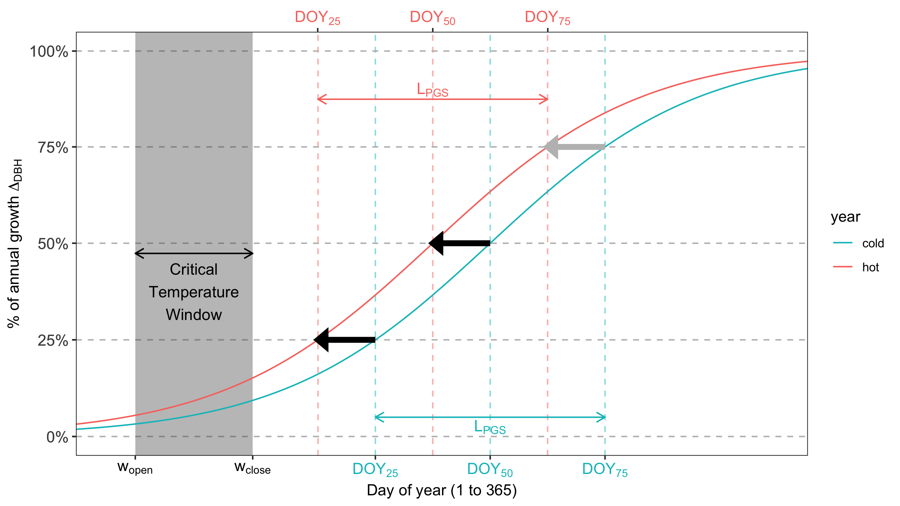

```{r, include=FALSE}
options(tinytex.verbose = TRUE)
options(knitr.table.format = "latex")
```
(a)



(b)

```{r eval = TRUE, echo=FALSE, warning=FALSE}
library(knitr)
library(kableExtra)
summary_table <- read.csv(file = "summary_table.csv", stringsAsFactors = FALSE, check.names = FALSE)

#add footnote markers:
#summary_table[0,3] <- paste0(summary_table[0,3], footnote_marker_number(1)) 
#summary_table[0,3] <- paste0(summary_table[0,3], footnote_marker_number(2)) 
#summary_table[8,3] <- paste0(summary_table[8,3], footnote_marker_number(3)) 
#summary_table[8,4] <- paste0(summary_table[8,4], footnote_marker_number(4)) 
#summary_table[8,6] <- paste0(summary_table[8,6], footnote_marker_number(5)) 

kable(summary_table, col.names = c("Variable", "Definition", "RP", "DP","RP", "DP"), format = "latex", booktabs = TRUE,  escape = F)%>%
  add_header_above(c(" ", " " , "SCBI" = 2, "Harvard Forest"=2)) %>%
  add_header_above(c(" ", " " , "Response to warmer spring T"=4), bold= TRUE) %>%
  column_spec(3:6, width = "1cm") %>%
  pack_rows("Timing of growth", 1, 5, latex_gap_space = "1em", colnum = 4, hline_before = FALSE) %>%
  pack_rows("Daily growth rate", 6, 6, latex_gap_space = "1em", colnum = 4, hline_before = FALSE) %>%
  pack_rows("Annual growth", 7, 8, latex_gap_space = "1em", colnum = 4, hline_before = FALSE) %>%
  kable_styling(latex_options = c("scale_down", "hold_position"), protect_latex = T) 

#add footnote: 
#kableExtra::footnote(number = c("'RP' and 'DP' refer to ring- and diffuse- porous species, respectively", "'-' and '+' = significant negative or positive response, respectively; 'n.s.'= no significant correlation"), footnote_as_chunk = FALSE, threeparttable=TRUE, escape = FALSE)
```
